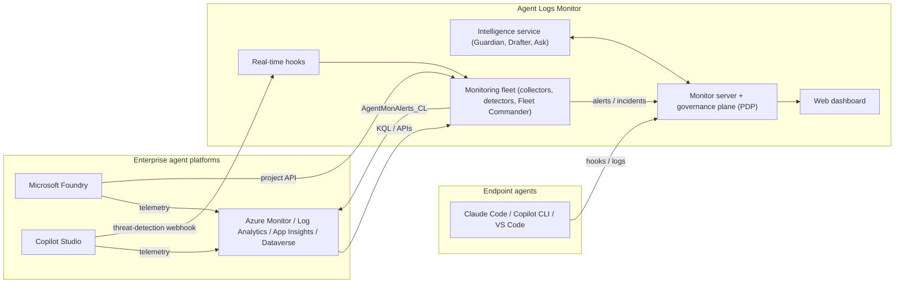

# Agent Logs Monitor

Agent Logs Monitor is a **monitoring and governance platform for AI agents**. It watches what agents actually do: the
prompts they receive, the tools they call, the code they generate and run, the data and destinations they touch. It
checks that behaviour against what each agent is supposed to do, and alerts, asks a human, or blocks when an agent goes
out of bounds.

It covers three kinds of agent activity:

| Where agents run | How the platform sees them | How it can intervene |
|---|---|---|
| **Endpoint coding agents**: Claude Code, GitHub Copilot CLI, VS Code agent mode, Copilot cloud agent | Enforcing hooks, session logs, transcripts | Inline allow / deny / ask / human approval **before a tool runs** |
| **Microsoft Foundry** agents (prompt, workflow and hosted agents, and classic assistants) | Foundry project API, GenAI traces in Application Insights, resource diagnostics, activity and network logs | Real-time gate via Agent Framework middleware and MCP tool approval; alerts and incidents |
| **Microsoft Copilot Studio** agents | Dataverse transcripts, Application Insights, the external threat-detection webhook, Purview audit | Real-time allow/block of every tool call (webhook); alerts and incidents |
| **Direct model inference** (people and apps calling Foundry models without an agent) | Resource diagnostics (caller identity, deployment, tokens) | Unregistered-caller, anomaly and access alerts |

## What it does

- **Understands intent.** Each monitored agent gets a *lane* (endpoint agents) or a *charter* (Foundry and Copilot
  Studio agents): its purpose, use cases, and allowed and forbidden capabilities and destinations. Charters are derived by
  gpt-5.5 from the agent's definition and can be overridden as code. Each session's goal is inferred from the user's
  turns and compared with the charter.
- **Detects out-of-bounds behaviour:**
  - out-of-scope requests and goal drift
  - direct and indirect prompt injection
  - out-of-charter tool use
  - agent-generated scripts that harvest credentials, exfiltrate data, persist or evade defences (with deobfuscation)
  - runaway loops
  - unregistered model callers
  - control-plane tampering (disabled diagnostics, key enumeration, guardrail changes)
- **Catches workarounds.** It keeps a per-session ledger of every blocked or refused action. It flags an agent that tries
  to reach the same outcome another way (different tool, encoding, file, or by asking the user to do it), and a user who
  keeps pushing a refused request through rephrasing or jailbreak framing.
- **Governs inline.** A Policy Decision Point combines deterministic rules, an LLM judge, Azure AI Content Safety Prompt
  Shields, runaway limits and human approval, and records every decision in a hash-chained audit log.
- **Measures itself.** An adversarial scenario runner scores detections for recall and precision against live lab
  agents. TypeSafe Jev runs in shadow mode beside the LLM judges to compare agreement, latency and cost.
- **Integrates with the SOC.** Alerts are mapped to OWASP Top 10 for LLM, OWASP Top 10 for Agentic Applications and
  MITRE ATLAS. They go to the dashboard, to a Log Analytics custom table with Azure Monitor/Sentinel rules and a
  workbook, and to Teams. Containment is always proposed for human approval, never automatic.

## Architecture



| Component | Folder | Details |
|---|---|---|
| Monitor server + governance plane (TypeScript, Express, `node:sqlite`) | [`src/`](src/) | [Application architecture](docs/architecture/application.md), [Governance](docs/governance.md) |
| Web dashboard (React, Vite, Material UI) | [`web/`](web/) | [Dashboard](docs/dashboard.md) |
| Monitoring fleet (Python, Microsoft Agent Framework) | [`fleet/`](fleet/) | [Fleet](docs/fleet.md), [Agent architecture](docs/architecture/agents.md) |
| Intelligence service (Python, Microsoft Agent Framework) | [`intelligence/`](intelligence/) | [Intelligence](docs/intelligence.md) |
| MCP server and MCP gateway | [`src/governance/mcp`](src/governance/mcp), [`src/gateway`](src/gateway) | [MCP server](docs/mcp.md), [MCP gateway](docs/mcp-gateway.md) |
| SDKs for custom agents (Agent Framework, Semantic Kernel, LangChain, OpenAI Agents) | [`packages/`](packages/) | [Python SDK](packages/sdk-python/README.md), [TypeScript SDK](packages/sdk-ts/README.md) |
| Azure infrastructure (Terraform, GitHub Actions), SIEM content, lab | [`infra/`](infra/) | [Cloud configuration](docs/cloud-configuration.md), [Infrastructure](infra/README.md) |

## Quick start

Requirements: Node.js ≥ 22.5 (for `node:sqlite`; CI uses 24), Python 3.12 for the fleet, intelligence service and Python
SDK, and Azure CLI for cloud sources. Full instructions: **[Installation](docs/installation.md)**.

```powershell
# Monitor server + dashboard + endpoint governance
Copy-Item .env.example .env        # one .env configures every component (optional for a local run)
.\install.ps1                      # npm install + build, then wires Claude Code hooks (-CopilotHooks / -VSCodeHooks for more)
.\start.ps1                        # → http://127.0.0.1:4317
```

On macOS/Linux use `./install.sh` (Claude Code and Copilot CLI hooks). To build without touching any agent hooks, run
`npm install; npm run build; npm start`.

```powershell
# Monitoring fleet for Foundry / Copilot Studio / direct inference (FLEET_* settings in .env)
cd fleet
python -m venv .venv; .\.venv\Scripts\Activate.ps1; pip install -e ".[dev]"
agentmon-fleet discover                 # Foundry accounts and projects in scope
agentmon-fleet run --once --console     # one monitoring cycle
agentmon-fleet hooks --port 8787        # real-time gate: Copilot Studio webhook, /evaluate
agentmon-fleet ask "What did my agents do today that was out of scope?"
```

The built-in lanes and fleet charters start in **observe** mode: they log and alert on would-deny decisions without
blocking. Move an agent to enforce once the would-deny rate looks right.

## Documentation

The **[documentation index](docs/README.md)** lists every page and reading paths by role.

| Guide | Covers |
|---|---|
| [Application architecture](docs/architecture/application.md) | Components, deployment modes, data stores, request flows, security model, repository layout |
| [Agent architecture](docs/architecture/agents.md) | Fleet Commander and specialist agents, detector pipeline, session state, real-time gate, governance-plane agents |
| [Data sources](docs/data-sources.md) | Every ingested source: content, collection, permissions, latency, detections |
| [Scan methodology: rules vs Jev vs LLM](docs/scan-methodology.md) | Layered evaluation, where each engine runs, shadow mode, benchmarks, promotion criteria |
| [Installation](docs/installation.md) | Local setup of every component, configuration, verification, troubleshooting |
| [Cloud configuration](docs/cloud-configuration.md) | Azure, Entra, Foundry, Log Analytics, Power Platform, Microsoft 365 and GitHub setup; RBAC; Terraform deployment |
| [Dashboard](docs/dashboard.md) | Tour of the web UI |

Reference pages cover [governance](docs/governance.md), [lanes](docs/lanes.md), [policies](docs/policies.md),
[classifiers](docs/classifiers.md), [posture](docs/posture.md), [hook surfaces](docs/governance-surfaces.md),
[the governance API](docs/governance-api.md), [cloud mode](docs/cloud-mode.md), [security](docs/security-auth.md),
[log ingestion](docs/log-ingestion.md), [analytics](docs/analytics.md), [the fleet](docs/fleet.md),
[fleet sources](docs/fleet-sources.md), [real-time hooks](docs/fleet-realtime-hooks.md), [Jev](docs/jev.md),
[the APIM AI gateway (future)](docs/apim-ai-gateway.md), [SIEM content](infra/sentinel/README.md) and
[evaluation datasets](eval/README.md).

## Development

```powershell
npm run dev              # API server with ts-node on :4317
npm run dev:web          # Vite dev server on :5173 (proxies /api and /live to :4317)
npm test                 # server and governance tests (vitest)
npm run test:web         # UI tests
npm run eval:redteam     # governance red-team scenarios
npm run eval:compare     # Jev vs LLM judge comparison
cd fleet; .\.venv\Scripts\python -m pytest -q     # fleet tests
```

CI ([`.github/workflows/ci.yml`](.github/workflows/ci.yml)) runs the following on every push and pull request:
- Node build and tests
- Python tests for the fleet, intelligence service and SDK
- the TypeScript SDK tests
- Docker image builds with Trivy scanning
- Terraform fmt, validate and test
- tfsec and Checkov

The deploy workflow ([`.github/workflows/deploy.yml`](.github/workflows/deploy.yml)) builds images and applies Terraform
with GitHub OIDC. See [Cloud configuration](docs/cloud-configuration.md).

## Status and roadmap

- **Endpoint governance:** available. The built-in lanes run in observe mode by default.
- **Monitoring fleet for Foundry:** available and validated on a live lab. The adversarial scenarios gave recall 0.727 and
  precision 1.0; the remaining misses were cases where the model refused ([details](docs/fleet.md#lab-validation-results-foundry-2026-09-30)).
- **Copilot Studio:** collectors, the threat-detection webhook and the lab plumbing are built and tested. End-to-end lab
  validation is the next phase ([runbook](infra/lab/COPILOT-STUDIO-SETUP.md)).
- **Later:**
  - an [APIM AI gateway](docs/apim-ai-gateway.md) for content capture on direct inference
  - per-session parallel detection
  - promotion of Jev from shadow mode, based on [these criteria](docs/jev.md)

See the roadmap in [docs/fleet.md](docs/fleet.md#roadmap).

## Security notes

- A single repo-root `.env` holds configuration and is git-ignored. Prefer `az login` or managed identity over client
  secrets and API keys.
- Captured agent content is redacted (secrets, PII) before storage and before any LLM analysis. Content from monitored
  agents is always wrapped as untrusted data in LLM prompts.
- Monitoring identities are least-privilege and read-only. The fleet only writes to its own alert table and to the
  dashboard.
