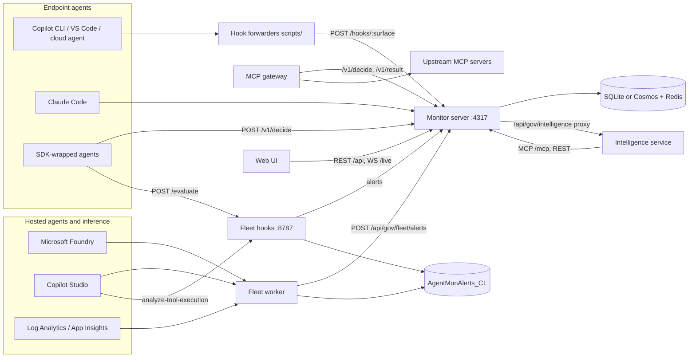
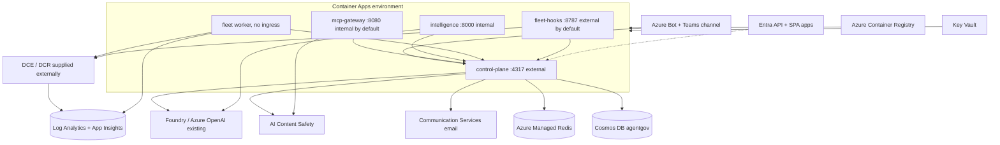
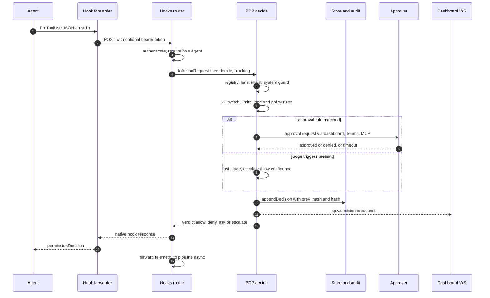
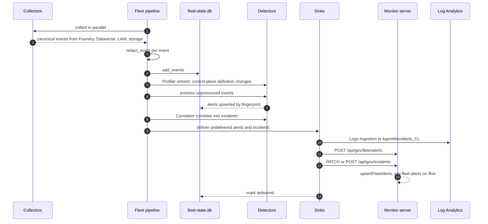
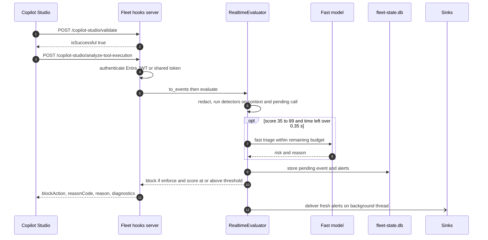

# Application architecture

This document is the architectural map of the repository. The platform monitors and governs AI agents across three families: **endpoint coding agents** (GitHub Copilot CLI, Copilot cloud agent, VS Code agent mode, Claude Code), **hosted agents** (Microsoft Foundry and Copilot Studio), and **direct model inference** (Azure OpenAI / Foundry model traffic). A Node.js monitor server (port `4317`) ingests agent telemetry, hosts the governance plane (Policy Decision Point, lanes, policies, approvals, audit chain), serves the React dashboard, and exposes REST, WebSocket, and MCP interfaces. Three optional services extend it: an MCP gateway that enforces decisions on MCP tool calls, a Python intelligence service (Guardian, lane drafter, chat), and a Python monitoring fleet that pulls Foundry, Copilot Studio, and Log Analytics telemetry and runs detectors. The same code runs as a single-user local enforcer (SQLite, loopback trust) or as an Azure control plane (Container Apps, Cosmos DB, Redis, Key Vault, Entra ID). Detailed behaviour lives in the linked component docs. This page covers how the components fit together.

## Contents

1. [System overview](#1-system-overview)
2. [Components](#2-components)
3. [Deployment modes](#3-deployment-modes)
4. [Data stores](#4-data-stores)
5. [Key request flows](#5-key-request-flows)
6. [Security model](#6-security-model)
7. [Repository layout](#7-repository-layout)
8. [Ports and endpoints quick reference](#8-ports-and-endpoints-quick-reference)

Related: [Agent architecture](agents.md) · [Docs index](../README.md) · [Data sources](../data-sources.md) · [Scan methodology](../scan-methodology.md) · [Installation](../installation.md) · [Cloud configuration](../cloud-configuration.md)

---

## 1. System overview

| Plane | Components | Responsibility |
|---|---|---|
| Telemetry | Monitor collectors, `/ingest`, fleet collectors | Capture agent sessions, tool calls, and model usage |
| Decision | PDP (`src/governance/pdp.ts`), MCP gateway, fleet hooks | Return allow / deny / ask / escalate before an action runs |
| Analysis | `src/analytics/*`, fleet detectors, intelligence service | Classify, score risk, correlate into incidents, investigate |
| Presentation | Web UI, WebSocket `/live`, MCP server `/mcp`, Log Analytics / Sentinel | Human and agent access to state |

---

## 2. Components

### 2.1 Monitor and dashboard server

| Item | Value |
|---|---|
| Purpose | Ingest endpoint-agent telemetry, analyse and store it, serve the dashboard API, the SPA, and live updates |
| Tech | Node.js ≥ 22.5 (built-in `node:sqlite`), TypeScript, Express 4, `ws`. Container base image: `node:24-alpine` |
| Entry point | [src/server.ts](../../src/server.ts) (`npm run dev` / `npm start` → `dist/server.js`) |
| Main folders | `src/collectors/`, `src/analytics/`, `src/routes/`, `src/pipeline.ts`, `src/db.ts`, `src/store.ts`, `src/timeline.ts`, `src/transcript-watcher.ts` |
| Port | `PORT`, default `4317`. `HOST` defaults to `127.0.0.1` in local mode and `0.0.0.0` in cloud mode |

**Ingestion paths**

| Path | Collector | Mechanism |
|---|---|---|
| `POST /ingest/:collectorId` | `claude-code`, `copilot-cli-hooks` (registered at startup in [src/collectors/registry.ts](../../src/collectors/registry.ts)) | Push. Acknowledged immediately, normalized on the next tick |
| `POST /hooks/:surface` | Hook adapters in `src/governance/hooks/` | Push. PDP decision first, then telemetry is forwarded to the pipeline |
| Copilot CLI session logs | `src/collectors/copilot-cli.ts` | Poll `$COPILOT_HOME/session-state/*/events.jsonl` (`COPILOT_CLI_ENABLED`, default on) |
| Foundry | `src/collectors/foundry.ts` | Poll, enabled when `FOUNDRY_ENDPOINT` is set |
| Copilot Studio | `src/collectors/copilot-studio.ts` | Poll Dataverse, enabled when `DATAVERSE_ORG_URL` is set |

**Pipeline** ([src/pipeline.ts](../../src/pipeline.ts), `processNormalizedEvent`): dedupe → upsert session/agent → `analyzeEvent` on the **unredacted** content → `redactDeep` payload → insert event → reconcile denials and insert findings → correlate capture channels → WebSocket broadcast (`timeline`, `sessions.updated`). A background pass (`startAnalysisBackfill`) re-analyses stored events when the analysis version or rules file changes, and re-redacts rows stored under a weaker redaction mode. See [../analytics.md](../analytics.md), [../classifiers.md](../classifiers.md), and [../log-ingestion.md](../log-ingestion.md).

**Live updates:** [src/broadcast.ts](../../src/broadcast.ts) attaches a WebSocket server at `/live`. Governance events are re-broadcast as `gov.decision`, `gov.approval`, `gov.agent`, `gov.lane`, `gov.policy`, `gov.posture`, `gov.incident`, and `gov.fleet.alerts`.

**Dashboard read API:** [src/routes/api.ts](../../src/routes/api.ts) mounted at `/api` (`/overview`, `/agents`, `/connections`, `/conversations`, `/events`, `/enforcements`, `/export`, `/sources`, `/settings`, `/sessions`).

### 2.2 Governance plane (inside the monitor server)

Bootstrapped by `initGovernance()` in [src/governance/index.ts](../../src/governance/index.ts).

| Module | Path | Role |
|---|---|---|
| PDP | `src/governance/pdp.ts` | `decide()`: registry lookup → lane resolve → checkpoint handling → system guard → kill switch → limits → lane rules → approvals → judge → default. Every decision is appended to the audit chain and emitted on `govBus` |
| Lanes | `src/governance/lanes/`, `lanes/*.yaml` | Lanes-as-code: per-agent rule sets with modes `observe`, `enforce`, `enforce+approval`. Files synced from `GOVERNANCE_LANES_DIR` (default `./lanes`) |
| Policies | `src/governance/policies/`, `src/policies/presets/`, `policies/*.yaml` | Org-wide policy overlays. Synced from `GOVERNANCE_POLICIES_DIR` (default `./policies`) |
| Judge | `src/governance/judge/` | LLM judge on Foundry / Azure OpenAI. Fast model (`JUDGE_FAST_DEPLOYMENT`) with escalation (`JUDGE_ESCALATION_DEPLOYMENT`) |
| Shields | `src/governance/shields/` | Azure AI Content Safety Prompt Shields on `tool_result`. Taints the session on detected injection |
| Intent | `src/governance/intent/` | Per-session goal, taint, and action ledger |
| Approvals | `src/governance/approvals/` | Human-in-the-loop requests, resolved via dashboard, MCP, or Teams |
| Alerts / Teams bot | `src/governance/alerts/` | Teams webhook, generic HMAC webhooks, ACS email. Bot route `POST /api/gov/teams/messages` when `TEAMS_BOT_APP_ID` is set |
| Audit | `src/governance/audit.ts` | Hash-chained decisions (`prev_hash`, `hash`). Verify and export via `/api/gov/audit/*` |
| Registry | `src/governance/registry/` | Agent identity resolution and status (`active`, `paused`, `quarantined`) |
| Limits | `src/governance/limits/`, `runtime/redis-limits.ts` | Rate and budget limits. In-process locally, Redis in cloud |
| Posture | `src/governance/posture/`, `src/posture/` | Endpoint configuration scanning (`npm run posture`) and findings |
| Sync | `src/governance/sync/` | Local → cloud outbox and lane/policy pull. Cloud replica → Cosmos telemetry mirror |
| MCP server | `src/governance/mcp/` | Streamable HTTP at `/mcp`, stdio via `npm run mcp`. Read tools plus admin tools (`approve_action`, `pause_agent`, `quarantine_session`, `propose_lane_change`, …) |
| Jev shadow | `src/governance/jev/` | Non-authoritative TypeSafe Jev comparisons. Never changes a decision |
| Routes | `src/governance/routes/` | `decide.ts` (`/v1/*`), `admin.ts`, `policies.ts`, `posture.ts`, `fleet.ts`, `jev.ts`, `enroll.ts`, `intelligence.ts` |

Detail: [../governance.md](../governance.md) · [../lanes.md](../lanes.md) · [../policies.md](../policies.md) · [../governance-api.md](../governance-api.md) · [../governance-surfaces.md](../governance-surfaces.md) · [../cloud-mode.md](../cloud-mode.md) · [../posture.md](../posture.md) · [../mcp.md](../mcp.md) · [../jev.md](../jev.md)

### 2.3 MCP gateway

| Item | Value |
|---|---|
| Purpose | Governance proxy in front of upstream MCP servers. Calls the PDP before each tool call and scans results. Hides denied tools by default |
| Tech | Node.js, `@modelcontextprotocol/sdk`, Express |
| Entry point | [src/gateway/main.ts](../../src/gateway/main.ts) (`npm run gateway`, or `--stdio`). Image: [Dockerfile.gateway](../../Dockerfile.gateway) |
| Config | JSON at `AGENT_GATEWAY_CONFIG` (see [agent-gateway.example.json](../../agent-gateway.example.json)). Upstream transports: `stdio`, `http`, `sse` |
| Port | `AGENT_GATEWAY_PORT`, default `4127`. The container listens on `8080` |
| Talks to | PDP at `AGENT_GATEWAY_PDP_URL` (default `http://127.0.0.1:4317`): `/v1/decide`, `/v1/result`, `/v1/lanes/effective`. Authenticates with a managed-identity token when `AGENT_GATEWAY_PDP_AUDIENCE` is set, otherwise with the token in `AGENT_GATEWAY_PDP_TOKEN` |

Detail: [../mcp-gateway.md](../mcp-gateway.md), [../apim-ai-gateway.md](../apim-ai-gateway.md).

### 2.4 Web UI

| Item | Value |
|---|---|
| Tech | React 19, Vite 6, MUI, TanStack Query, React Router 7, MSAL (`@azure/msal-browser`, `@azure/msal-react`) |
| Source | `web/src/` (routes in [web/src/App.tsx](../../web/src/App.tsx)) |
| Build | `npm run build:web` → `public/` (Vite `outDir: '../public'`), served by the monitor server with an SPA fallback. `AGENT_MONITOR_PUBLIC` overrides the folder |
| API access | Relative `/api/*` and `/api/gov/*`. WebSocket `/live`. In cloud mode a bearer token is attached (WebSocket: `?token=`) |
| Auth config | `VITE_ENTRA_TENANT_ID`, `VITE_ENTRA_CLIENT_ID`, `VITE_ENTRA_AUDIENCE`, plus runtime bootstrap from `GET /api/gov/auth-config` |

Pages (`web/src/pages/`): `overview`, `conversations`, `enforcements`, `governance`, `approvals`, `agents`, `lanes`, `policies`, `posture`, `incidents`, `fleet`, `jev`, `ask`.

### 2.5 Intelligence service (Python)

| Item | Value |
|---|---|
| Purpose | LLM agents over the monitor's MCP tools: **Guardian** (background trigger detection and incident investigation), **Drafter** (lane YAML proposals, validated by the monitor, stored as `proposed`), **Chat** ("Ask", read-only tools, SSE), **Jev triage** (shadow only) |
| Tech | Python 3.12, FastAPI, Uvicorn, Microsoft Agent Framework (Azure OpenAI or Foundry client) |
| Source | `intelligence/src/agentgov_intel/` (`app.py`, `guardian.py`, `drafter.py`, `chat.py`, `jev_triage.py`, `monitor_client.py`, `tools.py`, `af_adapter.py`) |
| Routes | `GET /health`, `POST /chat`, `POST /lanes/draft`, `POST /investigate` |
| Port | Container `8000` (internal ingress only). Local runs choose a port and set `INTELLIGENCE_URL` on the monitor |
| Talks to | Monitor MCP at `MONITOR_MCP_URL` and REST at `MONITOR_API_URL`, using `MONITOR_TOKEN` or a managed-identity token for `ENTRA_API_AUDIENCE`. The monitor proxies `/api/gov/intelligence/{chat,lanes/draft,investigate}` to it and forwards the caller's `Authorization` header |

Detail: [../intelligence.md](../intelligence.md).

### 2.6 Monitoring fleet (Python)

| Item | Value |
|---|---|
| Purpose | Pull-based monitoring of Foundry, Copilot Studio, and model inference. Profiles agents, runs detectors, correlates incidents, and delivers alerts. Also provides a real-time pre-tool gate for Copilot Studio and custom agents |
| Tech | Python ≥ 3.12, pydantic-settings, FastAPI (hooks), `azure-monitor-query`, `azure-monitor-ingestion`, Microsoft Agent Framework |
| CLI | `agentmon-fleet` ([cli.py](../../fleet/src/agentmon_fleet/cli.py)): `discover`, `collect`, `run`, `profiles`, `alerts`, `incidents`, `sessions`, `stats`, `hooks`, `ask`, `investigate`, `scenarios` |
| Config | `FLEET_*` env vars or a repo-root `.env` ([config.py](../../fleet/src/agentmon_fleet/config.py)) |
| Image | [fleet/Dockerfile](../../fleet/Dockerfile). Entrypoint `agentmon-fleet`, default command `run` |

| Package | Contents |
|---|---|
| `collectors/` | `discovery` (ARM), `foundry` / `foundry_classic` / `foundry_items` (Foundry data plane), `dataverse` / `dataverse_transcripts` (Copilot Studio), `law` / `law_queries` / `genai` (Log Analytics, GenAI spans), `storage` (diagnostic blob archive), `tenant` (Purview, Entra Agent ID, Defender XDR — feature-flagged) |
| `normalize/`, `codeanalysis/` | Effect and capability extraction, code extraction, deobfuscation |
| `detectors/` | `IntentAnalyst`, `ActionAnalyst`, `EvasionMonitor`, `InferenceNetworkSentinel`, `ControlPlaneAuditor`, `RunawayLoopDetector`, `UserPayloadDetector`, plus `Profiler` and `Correlator` |
| `pipeline.py` | `Fleet.collect()` → `analyze()` → `deliver()` |
| `sinks/` | `JsonlSink`, `LogAnalyticsSink` (DCE/DCR), `DashboardSink` (monitor server), `ConsoleSink` |
| `hooks/` | FastAPI real-time gate (`server.py`, `realtime.py`, `copilot_studio.py`, `auth.py`) |
| `agents/` | `FleetCommander` orchestrator with specialist agents over `FleetTools` (`ask`, `investigate`) |
| `scenarios/` | Adversarial lab scenario runner and lab agent definitions |

Detail: [../fleet.md](../fleet.md), [../fleet-sources.md](../fleet-sources.md), [../fleet-realtime-hooks.md](../fleet-realtime-hooks.md).

### 2.7 SDKs, templates, scripts, desktop app, evaluation

| Path | What it is |
|---|---|
| `packages/sdk-ts/` | `@agent-governance/sdk`: PDP client plus wrappers for OpenAI Agents, LangChain, and MCP |
| `packages/sdk-python/` | `agent-governance`: PDP client (`client.py`) and integrations for Agent Framework, LangChain, OpenAI Agents, and Semantic Kernel. `integrations/fleet.py` adds `FleetClient` (`/evaluate`, `/events`), Agent Framework middleware, and a Foundry MCP approval controller that call the **fleet hooks server** instead of the PDP |
| `templates/` | Hook configs for VS Code (`vscode/agent-governance-hooks.json`) and the Copilot cloud agent (`copilot-cloud-agent/.github/hooks/`), plus a Teams app manifest |
| `scripts/` | `copilot-hook-forward.ps1` / `.sh` forward hook JSON to `/hooks/<surface>`. They honour `AGENT_MONITOR_URL` / `AGENT_MONITOR_PORT`, `AGENT_GOVERNANCE_TOKEN`, and `AGENT_GOVERNANCE_FAIL_MODE`. `eval-*.ts` are evaluation runners |
| `electron/` | Windows tray app ([electron/main.js](../../electron/main.js)). Spawns `dist/server.js` on port `4317` with the database under the user-data folder and opens the dashboard in the browser |
| `eval/` | JSONL datasets for judge, triage, and injection evaluation ([eval/README.md](../../eval/README.md)) |

---

## 3. Deployment modes

`AGENT_MONITOR_MODE` selects the mode (`local` by default, `cloud` when set to `cloud`). See [src/governance/config.ts](../../src/governance/config.ts).

| Aspect | Local | Cloud |
|---|---|---|
| Host | One developer machine or the Electron tray app | Azure Container Apps |
| Bind | `127.0.0.1:4317`. Host-header and origin guard (`localRequestGuard`) | `0.0.0.0:4317` behind Container Apps ingress |
| Governance store | SQLite (`AGENT_MONITOR_DB`, default `./agent-monitor.db`) | Cosmos DB (`COSMOS_ENDPOINT`, database `COSMOS_DATABASE`, default `agentgov`) |
| Telemetry store | Same SQLite file | Per-replica ephemeral SQLite, mirrored to the Cosmos `events` container |
| Limits | In-process | Redis (`REDIS_URL`) |
| Caller auth | Loopback callers trusted (`GOVERNANCE_TRUST_LOOPBACK`, default `true`). Admin via one-time login URL printed at startup, or `GOVERNANCE_LOCAL_ADMIN_TOKEN` | Entra ID JWT (`ENTRA_API_AUDIENCE`, `ENTRA_TENANT_ID`) or HS256 device token (`GOVERNANCE_DEVICE_SIGNING_KEY`) |
| Secrets | `.env` file | Key Vault secret references |
| Link to cloud | Optional: `GOVERNANCE_CONTROL_PLANE_URL` + `GOVERNANCE_DEVICE_TOKEN` enable sync (pull lanes, policies, and agent status; push decisions, events, and posture to `/api/gov/sync/ingest`) | Issues device tokens at `POST /api/gov/devices/enroll` (PolicyAdmin) |

### 3.1 Azure deployment

Terraform lives in [infra/terraform/main.tf](../../infra/terraform/main.tf) with modules under `infra/terraform/modules/`: `observability`, `identity`, `acr`, `cosmos`, `redis`, `content_safety`, `foundry_access`, `communication`, `bot`, `keyvault`, `entra`, `container_apps`, `fleet`.

| Container App | Image / Dockerfile | Port | Ingress | Replicas (default) |
|---|---|---|---|---|
| `<name>-control-plane` | `agentgov/control-plane` / [Dockerfile](../../Dockerfile) | 4317 | External | 1–5 |
| `<name>-mcp-gateway` | `agentgov/mcp-gateway` / [Dockerfile.gateway](../../Dockerfile.gateway) | 8080 | `gateway.external_ingress`, default `false` | 1–5 |
| `<name>-intelligence` | `agentgov/intelligence` / [intelligence/Dockerfile](../../intelligence/Dockerfile) | 8000 | Internal only | 1–3 |
| `<name>-fleet` (optional, `enable_fleet`) | `agentgov/fleet` / [fleet/Dockerfile](../../fleet/Dockerfile) | none | None | exactly 1 |
| `<name>-fleet-hooks` (optional) | `agentgov/fleet`, args `hooks --host 0.0.0.0 --port 8787` | 8787 | `hooks_external_ingress`, default `true` | 1–1 (per-replica SQLite) |

Notes:

- Every app has its own **user-assigned managed identity** (`id-<name>-<app>`). All identities get `AcrPull`. Each identity reads only the Key Vault secrets it needs (`Key Vault Secrets User` scoped per secret).
- The Log Analytics DCE and DCR for `AgentMonAlerts_CL` are **not created** by this Terraform. Supply them through `fleet_alerts_dce`, `fleet_alerts_dcr_immutable_id`, and `fleet_alerts_dcr_resource_id`. Sentinel rules and the workbook are in [infra/sentinel/](../../infra/sentinel/README.md).
- A VNet is not created. `infrastructure_subnet_id` and `internal_load_balancer_enabled` attach the environment to an existing subnet.

Detail: [../../infra/README.md](../../infra/README.md), [../cloud-mode.md](../cloud-mode.md), [../cloud-configuration.md](../cloud-configuration.md), [../security-auth.md](../security-auth.md).

---

## 4. Data stores

### 4.1 Monitor SQLite (`node:sqlite`, WAL mode)

The monitor tables ([src/db.ts](../../src/db.ts)) and the local governance store ([src/governance/store/sqlite.ts](../../src/governance/store/sqlite.ts)) share one database file (`AGENT_MONITOR_DB`).

| Table | Owner | Contents |
|---|---|---|
| `sessions`, `agents`, `events` | Monitor | Agent sessions, sub-agents, normalized events with category, MCP server, risk level, and redaction mode |
| `findings` | Monitor | Classifier hits per event (masked sample only) |
| `poller_state` | Monitor | Collector cursors, sync cursors |
| `gov_lanes`, `gov_policies` | Governance | Versioned lane and policy documents plus YAML |
| `gov_agents`, `gov_session_intent` | Governance | Agent registry, per-session goal and taint |
| `gov_decisions` | Governance | PDP decisions with `prev_hash` / `hash` (the audit chain) |
| `gov_approvals`, `gov_incidents` | Governance | Human approvals, incidents |
| `gov_fleet_alerts` | Governance | Alerts pushed by the fleet (`alert_type`, `severity`, `platform`, `session_id`, `incident_id`) |
| `gov_outbox` | Governance | Sync outbox (`box`, `claimed_at`, `attempts`) |
| `gov_settings` | Governance | Classifier and posture configuration |
| `gov_posture_endpoints`, `gov_posture_findings` | Governance | Posture scan results |
| `gov_jev_shadow` | Governance | Jev shadow comparisons (not part of the audit chain) |

### 4.2 Cosmos DB (cloud)

Database `agentgov`. Access uses `DefaultAzureCredential` (local auth is disabled on the account). `COSMOS_KEY` is honoured only when set.

| Container | Partition key | Notes |
|---|---|---|
| `lanes` | `/tenantId` | Lanes and policies (`kind` field) |
| `agents` | `/tenantId` | Registry |
| `sessions` | `/sessionId` | Session intent |
| `decisions` | `/sessionId` | Decisions |
| `audit` | `/tenantId` | Audit-chain head document |
| `approvals`, `incidents`, `posture` | `/tenantId` | |
| `outbox` | `/box` | TTL enabled |
| `events` | `/sessionId` | Mirrored telemetry. TTL enabled |
| `jev_shadow` | `/pk` | TTL enabled |
| `fleet` | `/tenantId` | Fleet alerts (`kind: fleet_alert`) |

### 4.3 Fleet SQLite ([state.py](../../fleet/src/agentmon_fleet/state.py))

Path `FLEET_STATE_DB` (default `fleet-state.db`; `/data` `EmptyDir` volume in Azure). Tables: `cursors`, `events`, `profiles`, `sessions`, `denials`, `alerts` (fingerprint, count, `delivered`, `incident_id`), `incidents` (`synced`), `identities`, `baselines`.

### 4.4 Azure Monitor

| Store | Written by | Mechanism |
|---|---|---|
| `AgentMonAlerts_CL` (Log Analytics) | Fleet `LogAnalyticsSink` | Logs Ingestion API: `FLEET_ALERTS_DCE`, `FLEET_ALERTS_DCR_ID`, stream `FLEET_ALERTS_STREAM` (default `Custom-AgentMonAlerts`). Requires `Monitoring Metrics Publisher` on the DCR |
| Application Insights (`appi-<name>`, workspace-based) | Intelligence service | `configure_azure_monitor` when `APPLICATIONINSIGHTS_CONNECTION_STRING` is set |
| Log Analytics source tables | Read by fleet `law` collector | `LogsQueryClient` against `FLEET_LAW_WORKSPACE_ID` |

---

## 5. Key request flows

### 5.1 Endpoint agent hook → PDP decision

Surfaces: `claude-code`, `copilot-cli`, `vscode`, `copilot-cloud-agent` ([src/governance/hooks/router.ts](../../src/governance/hooks/router.ts)). The hook deadline is `HOOK_DEADLINE_MS` (default 110 s). The forwarders use the same default timeout.

Behaviour to note:

- In `observe` mode the effective verdict is `allow` and a would-deny is recorded. The system guard, which blocks tampering with the governance plane, denies in every mode.
- High and critical risk actions fail closed. Otherwise the lane's per-category `failMode` applies. If the PDP throws inside the hook router, `AGENT_GOVERNANCE_FAIL_MODE` (default `open`) decides.
- A native `ask` is returned only for `pre_tool` / `PreToolUse` on surfaces other than `copilot-cloud-agent`.
- On `tool_result`, Prompt Shields scan `NETWORK` and `MCP` categories by default and taint the session on detection.

### 5.2 Fleet monitoring cycle

`agentmon-fleet run` loops every `FLEET_POLL_INTERVAL_S` (default 120 s). `--once` runs one cycle.

LLM use per cycle is capped by `FLEET_LLM_BUDGET_PER_CYCLE`. The dashboard sink authenticates with `FLEET_MONITOR_TOKEN` (Key Vault secret `fleet-monitor-token` in Azure). `POST /api/gov/fleet/alerts` requires the `Agent` or `PolicyAdmin` role.

### 5.3 Copilot Studio real-time webhook

Copilot Studio calls the fleet hooks server before a tool runs. The documented budget is ≤ 1 s. The evaluator's internal deadline is `FLEET_HOOKS_DEADLINE_MS` (default 850 ms).

- Mode comes from the agent profile, otherwise from `FLEET_HOOKS_MODE` (default `observe`). The threshold comes from the profile, otherwise from `FLEET_HOOKS_BLOCK_THRESHOLD` (default 70).
- Any exception returns `blockAction: false` with diagnostics. The gate never breaks the agent.
- The same evaluator serves `POST /evaluate` (SDK `FleetClient`, Agent Framework middleware, MCP approval controller) and `POST /events` (telemetry push).

---

## 6. Security model

Detail: [../security-auth.md](../security-auth.md).

**Authentication** ([src/governance/auth.ts](../../src/governance/auth.ts))

| Caller | Local mode | Cloud mode |
|---|---|---|
| Browser / dashboard | Loopback trusted as `local-agent` (`Agent`, `Viewer`). Admin rights require the one-time `/api/gov/local-login` URL (12 h cookie session) | MSAL → Entra access token for the API app. WebSocket passes `?token=` |
| Hooks, SDKs, gateway | Loopback trusted, or bearer token | Entra token (managed identity or app) with the `Agent` role, or device token |
| Enrolled local enforcer | n/a | HS256 device token signed with `GOVERNANCE_DEVICE_SIGNING_KEY`. Roles are limited to `Agent` and `Viewer` |
| Automation on loopback | `GOVERNANCE_LOCAL_ADMIN_TOKEN` bearer → local admin | n/a |
| Fleet hooks | `FLEET_HOOKS_TOKEN`, or Entra JWT checked against `FLEET_HOOKS_AUDIENCE` / `FLEET_HOOKS_ALLOWED_APP_IDS`. Anonymous only when `FLEET_HOOKS_ALLOW_ANONYMOUS=true` (forced `false` in Azure) | same |

In local mode, `localRequestGuard` rejects non-loopback `Host` headers (421) and cross-origin mutations (403) on `/api`, `/v1`, `/hooks`, `/mcp`, and `/ingest`. Governance mutations must be `application/json` (415 otherwise).

**Roles** (Entra app roles defined in `infra/terraform/modules/entra`). Role expansion: `PolicyAdmin` ⊃ `Approver` ⊃ `Viewer`.

| Role | Grants |
|---|---|
| `Viewer` | Read dashboards, decisions, lanes, policies, incidents, fleet alerts, audit verify/export, chat |
| `Approver` | Approve or deny pending approvals |
| `PolicyAdmin` | Author and activate lanes and policies, pause agents, manage posture and classifiers, enroll devices, lane drafting, investigation |
| `Agent` | Workload identity: `/hooks/*`, `/ingest` (cloud), post fleet alerts, incidents, and Jev shadow records |

In Azure, the `mcp-gateway` and `intelligence` managed identities are assigned the `Agent` app role.

**Data protection**

- **Redaction.** The monitor analyses content before storage and stores only the redacted form. `REDACT_PAYLOADS` is `secrets` by default (`off` and `all` also available). PDP decision reasons and approval summaries pass through `redactString`. The fleet applies `redact_event` (secrets, plus PII when `FLEET_REDACT_PII=true`, the default) before storing or sending events. Local-to-cloud sync respects the lane's `sync.dataPolicy` (`redacted`, `full`, `metadata-only`).
- **Prompt-injection guard for LLM calls.** The judge wraps goal, trajectory, and action in `<untrusted_*>` blocks with length caps ([src/governance/judge/prompts.ts](../../src/governance/judge/prompts.ts)). Fleet LLM calls wrap captured data with `untrusted()` and a system instruction that treats it as data ([fleet/src/agentmon_fleet/llm.py](../../fleet/src/agentmon_fleet/llm.py)). Jev triage sends only filtered, code-computed state. Guardian is blocked from modifying its own `monitor-guardian` lane.
- **Least-privilege identities.** Every Container App runs as a separate user-assigned identity. Cosmos data-plane access is limited to control-plane and intelligence. Content Safety access is limited to control-plane and gateway. Key Vault reads are scoped per secret. Fleet roles are limited to Log Analytics Reader, Monitoring Reader, Security Reader, Azure AI User, Storage Blob Data Reader, and Monitoring Metrics Publisher on the alerts DCR. The fleet module rejects `Owner`, `Contributor`, `User Access Administrator`, and `Role Based Access Control Administrator`.

---

## 7. Repository layout

| Path | Contents |
|---|---|
| `src/` | Monitor server: collectors, analytics, pipeline, SQLite, REST/WS routes |
| `src/governance/` | Governance plane: PDP, lanes, policies, judge, shields, approvals, alerts, audit, store, sync, MCP server, Jev |
| `src/gateway/` | MCP governance gateway |
| `src/posture/`, `src/policies/` | Endpoint posture scanner and CLI, policy presets |
| `web/` | React dashboard (builds to `public/`) |
| `public/` | Built SPA served by the monitor |
| `intelligence/` | Python intelligence service |
| `fleet/` | Python monitoring fleet (`src/agentmon_fleet`, `charters/`, `scenarios/`, `tests/`) |
| `packages/` | `sdk-ts`, `sdk-python` |
| `lanes/`, `policies/` | Lanes-as-code (`default.yaml`, `coding-agent.yaml`, `monitor-guardian.yaml`) and `org-baseline.yaml` |
| `templates/` | Hook configurations for VS Code and the Copilot cloud agent, Teams app manifest |
| `scripts/` | Hook forwarders and evaluation scripts |
| `electron/` | Desktop tray app |
| `infra/` | `terraform/` (Azure), `sentinel/` (rules and workbook), `lab/` (lab provisioning scripts) |
| `eval/` | Evaluation datasets |
| `test/` | Vitest suites: `governance/`, `redteam/`, `e2e/`, `policies/`, `posture/` |
| `docs/` | Component documentation (this folder: architecture) |
| `.github/workflows/` | `ci.yml` (build, test, Terraform, IaC and image scans), `deploy.yml` |
| `Dockerfile`, `Dockerfile.gateway` | Control-plane and gateway images |
| `install.ps1`, `install.sh`, `start.ps1` | Local install and start scripts |

---

## 8. Ports and endpoints quick reference

| Component | Port | Endpoint | Auth (cloud) | Purpose |
|---|---|---|---|---|
| Monitor | 4317 | `GET /health` | none | Liveness |
| Monitor | 4317 | `POST /ingest/:collectorId` | `Agent` | Telemetry push (ack-first) |
| Monitor | 4317 | `POST /hooks/{claude-code,copilot-cli,vscode,copilot-cloud-agent}` | `Agent` | Enforcing hooks |
| Monitor | 4317 | `POST /v1/decide`, `/v1/goal`, `/v1/result`. `GET /v1/approvals/:id`, `/v1/lanes/effective` | authenticated | PDP API for SDKs and the gateway |
| Monitor | 4317 | `/api/*` | `Viewer` | Telemetry dashboard API |
| Monitor | 4317 | `/api/gov/*` | per route | Governance admin API ([../governance-api.md](../governance-api.md)) |
| Monitor | 4317 | `GET /api/gov/auth-config` | none | MSAL bootstrap |
| Monitor | 4317 | `POST /api/gov/fleet/alerts`, `GET /api/gov/fleet/alerts`, `/fleet/summary` | `Agent`/`PolicyAdmin`, `Viewer` | Fleet alert intake and query |
| Monitor | 4317 | `POST /api/gov/devices/enroll` | `PolicyAdmin` | Issue device token |
| Monitor | 4317 | `POST /api/gov/sync/ingest`, `GET /api/gov/sync/lanes` | authenticated, `Agent` | Local → cloud sync (cloud mode only) |
| Monitor | 4317 | `/api/gov/intelligence/{chat,lanes/draft,investigate}` | `Viewer`, `PolicyAdmin` | Proxy to intelligence |
| Monitor | 4317 | `POST /api/gov/teams/messages` | Bot Framework token | Teams bot (when `TEAMS_BOT_APP_ID` set) |
| Monitor | 4317 | `/mcp`, `/.well-known/oauth-protected-resource` | bearer token (Entra or device) | Monitor MCP server |
| Monitor | 4317 | `WS /live` | `Viewer` (`?token=`) | Live updates |
| Web dev server | 5173 | Vite | n/a | Development only (allowed origin outside production) |
| MCP gateway | 4127 local, 8080 container | `/mcp`, `/health` | Entra (`AGENT_GATEWAY_AUDIENCE`) | Governed MCP proxy |
| Intelligence | 8000 container | `/health`, `/chat`, `/lanes/draft`, `/investigate` | forwarded bearer | LLM agents |
| Fleet hooks | 8787 | `/health`, `/copilot-studio/validate`, `/copilot-studio/analyze-tool-execution`, `/evaluate`, `/events` | Entra JWT or shared token | Real-time gate |
