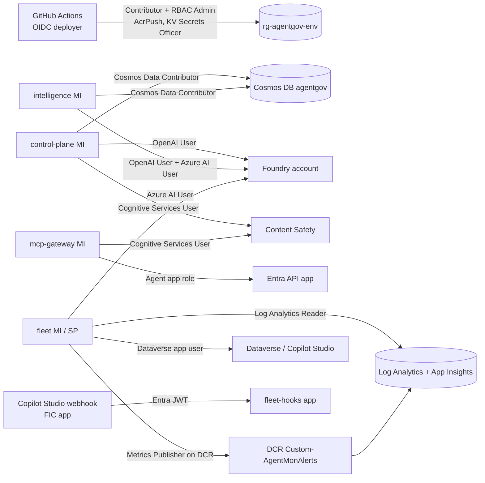

# Cloud configuration guide

This page lists everything you configure outside the repository so the platform works end to end: the **governance control plane** (TypeScript control plane, MCP gateway, intelligence service) and the **monitoring fleet** (`fleet/`). It covers Azure, Microsoft Entra, Microsoft Foundry, Power Platform / Copilot Studio, Microsoft 365 / Defender, and GitHub, plus the Terraform and GitHub Actions deployment.

Each setting here comes from `infra/terraform`, `infra/lab`, `infra/sentinel`, `.github/workflows` or `fleet/src/agentmon_fleet`. Values in `<angle-brackets>` are placeholders. Put your own values in their place. Never commit them if they're secrets.

Related pages: [../infra/README.md](../infra/README.md) (Terraform reference), [fleet-sources.md](fleet-sources.md) (what each collector reads), [fleet-realtime-hooks.md](fleet-realtime-hooks.md) (webhook auth), [security-auth.md](security-auth.md), [cloud-mode.md](cloud-mode.md), [architecture/application.md](architecture/application.md), [installation.md](installation.md), [data-sources.md](data-sources.md).

## Contents

1. [Overview](#1-overview)
2. [Identities and least-privilege RBAC](#2-identities-and-least-privilege-rbac)
3. [Microsoft Foundry](#3-microsoft-foundry)
4. [Log Analytics and Azure Monitor](#4-log-analytics-and-azure-monitor)
5. [Power Platform and Copilot Studio](#5-power-platform-and-copilot-studio)
6. [Microsoft 365 and tenant collectors (optional)](#6-microsoft-365-and-tenant-collectors-optional)
7. [Governance control plane in Azure (Terraform and CI/CD)](#7-governance-control-plane-in-azure-terraform-and-cicd)
8. [Network](#8-network)
9. [Lab reference setup](#9-lab-reference-setup)
10. [Configuration checklist](#10-configuration-checklist)

---

## 1. Overview

| Layer | What you configure | Managed by |
|---|---|---|
| Control plane | Resource group, Container Apps, Cosmos DB, Azure Managed Redis, Key Vault, ACR, Content Safety, Log Analytics + App Insights, Entra API/SPA apps | Terraform (`infra/terraform`) |
| Monitoring fleet in Azure | Fleet managed identity, worker + hooks Container Apps, read-only RBAC | Terraform (`enable_fleet = true`) |
| Telemetry sources | Foundry diagnostic settings, Foundry → App Insights tracing, VNet flow logs, activity log export, Defender for AI | Scripts in `infra/lab` + manual |
| Alert sink / SIEM | `AgentMonAlerts_CL` table, DCE, DCR, alert rules, workbook | Manual + `infra/sentinel/deploy-sentinel.ps1` |
| Copilot Studio | Managed environment, Dataverse application user, transcripts, App Insights, threat-detection webhook | `provision-lab.ps1 -Steps dataverse`, `create-webhook-app.ps1`, PPAC (manual) |
| Tenant (optional) | O365 Management Activity API, Graph (Entra Agent ID, Defender hunting) | Manual admin consent |
| CI/CD | GitHub OIDC deployer app, environments, secrets, variables | Manual bootstrap |

The diagram shows who reads what. Solid arrows are data-plane reads or writes, and each label names the role that allows the call.



All four managed identities also get **AcrPull** on the registry and **Key Vault Secrets User** on their own secrets only. Those edges are left out of the diagram to keep it readable.

---

## 2. Identities and least-privilege RBAC

### 2.1 Identity matrix

Names follow `<prefix>-<env>` (default `agentgov-dev`). "TF" means Terraform creates the assignment. "Manual" means you do it yourself.

| Identity | Role / permission | Scope | Why | Source |
|---|---|---|---|---|
| **GitHub deployer** (app reg + federated credentials, no secret) | Contributor | Subscription (or the pre-created `rg-<prefix>-<env>`) | Create resources | Manual bootstrap |
| | Role Based Access Control Administrator | Subscription/RG **and** the existing Foundry account | Terraform creates role assignments (AcrPull, KV Secrets User, Cognitive Services, fleet roles) | Manual bootstrap |
| | Storage Blob Data Contributor | `tfstate` container | Terraform state (shared keys disabled) | Manual bootstrap |
| | AcrPush | ACR | Push images | TF (`modules/acr`) |
| | Key Vault Secrets Officer | Key Vault | Write secrets | TF (`modules/keyvault`) |
| | Graph `Application.ReadWrite.OwnedBy`, `AppRoleAssignment.ReadWrite.All` (application, admin consent) | Tenant | Create API/SPA apps and assign app roles | Manual |
| **`id-<prefix>-<env>-control-plane`** | AcrPull | ACR | Image pull | TF |
| | Key Vault Secrets User | Secrets `redis-url`, `alert-webhook-secret`, `device-signing-key`, `appinsights-connection-string` (+ `teams-webhook-url`, `alert-webhook-urls` when set) | secretRefs | TF (per-secret scope) |
| | Cosmos DB Built-in Data Contributor (SQL role) | Cosmos account | Governance store | TF (`modules/cosmos`) |
| | Cognitive Services OpenAI User | Foundry account | LLM judge | TF (`modules/foundry_access`) |
| | Cognitive Services User | Content Safety account | Prompt Shields | TF (`modules/content_safety`) |
| | Communication and Email Service Owner | ACS (optional) | Email alerts | TF (`communication_enabled`) |
| **`id-<prefix>-<env>-mcp-gateway`** | AcrPull; Key Vault Secrets User on `appinsights-connection-string`, `gateway-config` | ACR; secrets | Image pull; config | TF |
| | Cognitive Services User | Content Safety | Prompt Shields on tool results | TF |
| | App role **Agent** | `agentgov-<env>-api` enterprise app | Call the PDP | TF (`modules/entra`) |
| **`id-<prefix>-<env>-intelligence`** | AcrPull; Key Vault Secrets User on `appinsights-connection-string` | ACR; secret | | TF |
| | Cosmos DB Built-in Data Contributor | Cosmos account | Guardian reads/writes | TF |
| | Cognitive Services OpenAI User; **Azure AI User** (only when `foundry_project_name` is set) | Foundry account | Guardian / chat / Agent Service | TF |
| | App role **Agent** | API enterprise app | Call control-plane APIs | TF |
| **`id-<prefix>-<env>-fleet`** (only with `enable_fleet`) | AcrPull; Key Vault Secrets User on `appinsights-connection-string` + `fleet-monitor-token`, `fleet-foundry-api-key`, `fleet-typesafe-api-key` (only those that are set) | ACR; secrets | | TF |
| | Log Analytics Reader | `fleet_law_resource_id` (default: platform workspace) | `law` collector, `run_kql` | TF (`modules/fleet`) |
| | Monitoring Reader + Security Reader | Each `fleet_scope_subscriptions` entry (default: deployment subscription) | ARM discovery, diagnostic settings, Defender alerts | TF |
| | Azure AI User (same role as **Foundry User**) | `foundry_account_id` + each `fleet_foundry_account_ids` | Foundry data plane, fleet LLM calls | TF |
| | Monitoring Reader | Each `fleet_monitored_resource_ids` | Resources outside scope subscriptions | TF |
| | Storage Blob Data Reader | `fleet_diagnostics_storage_account_id` | `storage` collector | TF |
| | Monitoring Metrics Publisher | `fleet_alerts_dcr_resource_id` | Logs Ingestion API → `AgentMonAlerts_CL` | TF |
| | Privileged Monitoring Data Reader (only if `AppGenAIContent` is Protected) | Workspace | GenAI content | Manual |
| | Dataverse application user + role **AgentMon Fleet Reader** | Power Platform environment | Bots, components, transcripts | Manual / `provision-lab.ps1` |
| | Graph / O365 app roles (section 6) | Tenant | Optional tenant collectors | Manual |
| **Lab fleet service principal** (app reg with a client secret, local runs) | The same Azure roles as the fleet MI, with **Foundry User** on the Foundry account | As above | Local `agentmon-fleet` | Manual / `provision-lab.ps1` |
| **Webhook app** (`AgentMon Threat Detection`, FIC, no secret) | No Azure RBAC. Its app id goes in `FLEET_HOOKS_ALLOWED_APP_IDS` / `FLEET_HOOKS_AUDIENCE` and in PPAC | Tenant | Copilot Studio → fleet hooks | `create-webhook-app.ps1` |
| **`agentgov-<env>-api`** (app reg) | Exposes `access_as_user`; app roles `Viewer`, `Approver`, `PolicyAdmin`, `Agent`; **assignment required** | Tenant | Audience for control plane, `/mcp`, gateway | TF (`modules/entra`) |
| **`agentgov-<env>-dashboard`** (SPA) | Delegated `access_as_user` (grant admin consent) | Tenant | MSAL sign-in | TF + manual consent |
| Users / groups | `Viewer` / `Approver` / `PolicyAdmin` | API enterprise app | Dashboard access | TF (`app_role_principals`) or manual |

Guardrails in code:

- `modules/fleet` has a precondition that rejects `Owner`, `Contributor`, `User Access Administrator` and `Role Based Access Control Administrator` for the fleet identity.
- Cosmos, Content Safety and ACR use Entra only (`local_authentication_enabled = false`, `local_auth_enabled = false`, `admin_enabled = false`). Redis still uses an access key, and that key is stored only in Key Vault (`redis-url`).
- Key Vault uses RBAC mode with purge protection and 90-day soft delete. Reads are granted **per secret**, not per vault.

### 2.2 Manual grants (copy-paste)

```powershell
$fleetSp = az ad sp show --id <fleet-app-or-mi-client-id> --query id -o tsv   # object id

# Log Analytics Reader on the agent-log workspace
az role assignment create --assignee-object-id $fleetSp --assignee-principal-type ServicePrincipal `
  --role "Log Analytics Reader" --scope "<workspace-resource-id>"
# Monitoring Reader + Security Reader on each subscription in scope
az role assignment create --assignee-object-id $fleetSp --assignee-principal-type ServicePrincipal `
  --role "Monitoring Reader" --scope "/subscriptions/<subscription-id>"
az role assignment create --assignee-object-id $fleetSp --assignee-principal-type ServicePrincipal `
  --role "Security Reader" --scope "/subscriptions/<subscription-id>"
# Foundry data plane ("Azure AI User"; newer tenants show it as "Foundry User")
az role assignment create --assignee-object-id $fleetSp --assignee-principal-type ServicePrincipal `
  --role "Azure AI User" --scope "<foundry-account-resource-id>"
# Diagnostics archive and alert DCR
az role assignment create --assignee-object-id $fleetSp --assignee-principal-type ServicePrincipal `
  --role "Storage Blob Data Reader" --scope "<diagnostics-storage-account-resource-id>"
az role assignment create --assignee-object-id $fleetSp --assignee-principal-type ServicePrincipal `
  --role "Monitoring Metrics Publisher" --scope "<dcr-resource-id>"
```

Verify:

```powershell
az role assignment list --assignee $fleetSp --all --query "[].{role:roleDefinitionName, scope:scope}" -o table
```

---

## 3. Microsoft Foundry

The platform uses an **existing** Foundry (AI Services) account. Terraform only reads it (`data "azurerm_cognitive_account"`) and grants roles on it.

### 3.1 Model deployments

Create these deployments in the Foundry account, or override the names:

| Deployment (default name) | Used by | Override |
|---|---|---|
| `gpt-4.1-mini` | Control-plane fast judge; fleet fast model (hooks path, scenario runner) | `judge_fast_deployment`; `fleet_fast_model_deployment` / `FLEET_FAST_MODEL_DEPLOYMENT` |
| `gpt-5` | Control-plane escalation judge; intelligence Guardian | `judge_escalation_deployment`, `guardian_deployment` |
| `gpt-5.5` | Fleet reasoning model (detectors, orchestrator) | `fleet_model_deployment` / `FLEET_MODEL_DEPLOYMENT` |
| `text-embedding-3-large` | Fleet embeddings (`llm.py`) | `FLEET_EMBEDDING_DEPLOYMENT` (Terraform: `fleet_extra_env`) |

```powershell
az cognitiveservices account deployment list -g <foundry-rg> -n <foundry-account> --query "[].name" -o tsv
```

### 3.2 Data-plane access

- **Control plane and intelligence**: Terraform grants `Cognitive Services OpenAI User`. Intelligence also gets `Azure AI User`, but only when `foundry_project_name` is set, which also sets `FOUNDRY_PROJECT_ENDPOINT=https://<subdomain>.services.ai.azure.com/api/projects/<project>`.
- **Fleet**: `Azure AI User` on every account it monitors. It calls the project endpoint with scope `https://ai.azure.com/.default` (`/agents`, `/assistants`, `/openai/v1/responses`, `/threads`).
- A Foundry account in **another subscription** still gets its role assignments. Set `foundry_openai_endpoint` explicitly, because the Terraform data source reads in the provider subscription.
- Key auth is optional and discouraged. `FLEET_FOUNDRY_API_KEY` exists only as a Key Vault-backed secret, and `FOUNDRY_OPENAI_API_KEY` stays unset in Azure.

### 3.3 Diagnostic settings (resource logs)

The fleet's `law.inference` / `law.audit` queries read `AzureDiagnostics` rows with categories `RequestResponse`, `AzureOpenAIRequestUsage` and `Audit`. `enable-ai-diagnostics.ps1` adds one setting named after `-SettingName` (default `agentmon-lab`) to every Cognitive Services account in a subscription:

| Resource | Logs | Metrics | Destination |
|---|---|---|---|
| Account (any kind) | `categoryGroup: allLogs` | `AllMetrics` | Workspace; plus the storage account when the resource is in `-StorageRegion` (diagnostic settings need a same-region storage account) |
| Foundry project (`AIServices` accounts, `-IncludeProjects`) | `Audit`, `Trace` | none | Same |

The script never changes other settings, and it skips resources that already have 5 settings.

```powershell
# Always pass every parameter: the script defaults are the maintainer's lab resources.
./infra/lab/enable-ai-diagnostics.ps1 -SubscriptionId <subscription-id> `
  -WorkspaceId "<workspace-resource-id>" -StorageId "<storage-account-resource-id>" `
  -StorageRegion <region> -SettingName agentmon -WhatIf      # remove -WhatIf to apply
```

Manual equivalent for one account:

```powershell
az monitor diagnostic-settings create -n agentmon --resource "<foundry-account-resource-id>" `
  --workspace "<workspace-resource-id>" `
  --logs '[{"categoryGroup":"allLogs","enabled":true}]' --metrics '[{"category":"AllMetrics","enabled":true}]'
```

Resource logs carry **no prompt or completion content**. Content comes from the data plane (3.2) or tracing (3.4).

### 3.4 Tracing to Application Insights

**Server-side (Agent Service).** Connect a workspace-based Application Insights resource to the Foundry project: *Foundry portal → project → Agents → Traces → connect*. Prompt and hosted agents are then traced automatically into `AppDependencies`. GenAI content is written to `AppGenAIContent`, which the `law.genai` query joins on `SpanId`. Check the connection:

```powershell
az rest --method get `
  --url "https://management.azure.com<foundry-account-resource-id>/projects/<project>/connections?api-version=2025-06-01" `
  --query "value[?properties.category=='AppInsights'].properties.target" -o tsv
```

`provision-lab.ps1 -Steps foundry` runs this check and warns when the connection is missing.

**Client-side (your agent apps).** Code that you run yourself with the Foundry / Azure AI SDKs must set the Microsoft-documented tracing variables in **its own** environment. The fleet doesn't read them.

| Variable | Value | Effect |
|---|---|---|
| `APPLICATIONINSIGHTS_CONNECTION_STRING` | App Insights connection string | Exporter target |
| `AZURE_EXPERIMENTAL_ENABLE_GENAI_TRACING` | `true` | Enables GenAI instrumentation (Python, C#) |
| `OTEL_INSTRUMENTATION_GENAI_CAPTURE_MESSAGE_CONTENT` | `true` | Records prompts, outputs and tool arguments (**content recording**) |

Content recording captures user data. Turn it on only where you have agreed to capture content (the lab does). The fleet redacts secrets and PII (`FLEET_REDACT_PII=true`) before it stores anything or sends it to an LLM.

If you make `AppGenAIContent` a **Protected** table, grant the reader **Privileged Monitoring Data Reader** as well.

### 3.5 Guardrails, content filters and MCP approval

- **Guardrails / content filters**: configure them in the Foundry portal (*Guardrails + controls*) per deployment or per agent. An agent guardrail fully overrides the deployment guardrail. Blocks show up as `content_filter` / `jailbreak` errors in Responses and as `AzureDiagnostics` `400` rows, and the fleet records them as denials.
- **Content Safety (control plane)**: Terraform creates `cs-<prefix>-<env>-<suffix>` with a custom subdomain and `local_auth_enabled = false`. Set `content_safety_enabled = false` to skip it.
- **MCP `require_approval`**: leave Foundry MCP tools at `require_approval: "always"` (the default) and answer approval requests with the fleet SDK helper `mcp_approval_responses` (see [fleet-realtime-hooks.md](fleet-realtime-hooks.md#foundry-mcp-require_approval-controller)). Hosted-agent toolboxes don't enforce it at the MCP endpoint, so the runtime has to enforce it.

### 3.6 Defender for AI

The `law.defender` query reads `SecurityAlert | where AlertType startswith "AI."`. Two things must be in place:

```powershell
az security pricing create -n AI --tier standard          # Defender for Cloud AI threat protection (billable)
az security pricing show -n AI --query pricingTier -o tsv
```

Then send alerts to the workspace. Either enable Microsoft Sentinel on it, or set up *Defender for Cloud → Environment settings → <subscription> → Continuous export → Log Analytics workspace → Security alerts*. The fleet identity also needs **Security Reader** on the subscription, which Terraform grants.

---

## 4. Log Analytics and Azure Monitor

### 4.1 Workspace and Application Insights

Terraform (`modules/observability`) creates `log-<prefix>-<env>` (PerGB2018, `log_retention_days`, default 30) and a **workspace-based** `appi-<prefix>-<env>`. The Container Apps environment, ACR, Cosmos and Key Vault send their diagnostics there. The App Insights connection string is stored in Key Vault as `appinsights-connection-string`.

The fleet can read a different workspace. Set `fleet_law_workspace_id` (the GUID) and `fleet_law_resource_id` (the resource id, where Log Analytics Reader is granted).

Send the subscription activity log to the workspace for `law.activity`:

```powershell
az monitor diagnostic-settings subscription create -n agentmon-activity --location <region> `
  --workspace "<workspace-resource-id>" `
  --logs '[{"category":"Administrative","enabled":true}]'
```

### 4.2 Alert table, DCE and DCR

The fleet's `LogAnalyticsSink` uploads through the Logs Ingestion API when both `FLEET_ALERTS_DCE` and `FLEET_ALERTS_DCR_ID` are set. It writes to stream `FLEET_ALERTS_STREAM` (default `Custom-AgentMonAlerts`) and uses scope `https://monitor.azure.com/.default`. Row schema (`sinks/base.py::alert_row`):

| Column | Type | Column | Type |
|---|---|---|---|
| `TimeGenerated` | datetime | `AgentName` | string |
| `AlertId` | string | `SessionId` | string |
| `IncidentId` | string | `UserId` | string |
| `Fingerprint` | string | `LaneId` | string |
| `AlertType` | string | `Detector` | string |
| `Severity` | string | `Action` | string |
| `Score` | real | `OwaspLlm` | dynamic |
| `Title` | string | `OwaspAgentic` | dynamic |
| `Summary` | string | `MitreAtlas` | dynamic |
| `Platform` | string | `Evidence` | dynamic |
| `AgentId` | string | `SourceEventIds` | dynamic |

Create the table, the endpoint and the rule:

```powershell
$rg = '<resource-group>'; $ws = '<workspace-name>'; $loc = '<region>'
$cols = 'TimeGenerated=datetime AlertId=string IncidentId=string Fingerprint=string AlertType=string Severity=string ' +
        'Score=real Title=string Summary=string Platform=string AgentId=string AgentName=string SessionId=string ' +
        'UserId=string LaneId=string Detector=string Action=string OwaspLlm=dynamic OwaspAgentic=dynamic ' +
        'MitreAtlas=dynamic Evidence=dynamic SourceEventIds=dynamic'
az monitor log-analytics workspace table create -g $rg --workspace-name $ws -n AgentMonAlerts_CL --columns $cols.Split(' ')

az monitor data-collection endpoint create -g $rg -n dce-agentmon-alerts -l $loc --public-network-access Enabled
$dceId = az monitor data-collection endpoint show -g $rg -n dce-agentmon-alerts --query id -o tsv
az monitor data-collection endpoint show -g $rg -n dce-agentmon-alerts --query logsIngestion.endpoint -o tsv   # -> FLEET_ALERTS_DCE
```

Save the rule body as `dcr.json`. Its `columns` array must list the same 22 columns and types as the table:

```json
{
  "location": "<region>",
  "properties": {
    "dataCollectionEndpointId": "<dce-resource-id>",
    "streamDeclarations": {
      "Custom-AgentMonAlerts": {
        "columns": [
          { "name": "TimeGenerated", "type": "datetime" }, { "name": "AlertId", "type": "string" },
          { "name": "Score", "type": "real" }, { "name": "Evidence", "type": "dynamic" }
        ]
      }
    },
    "destinations": { "logAnalytics": [ { "name": "law", "workspaceResourceId": "<workspace-resource-id>" } ] },
    "dataFlows": [ { "streams": [ "Custom-AgentMonAlerts" ], "destinations": [ "law" ],
                     "transformKql": "source", "outputStream": "Custom-AgentMonAlerts_CL" } ]
  }
}
```

The snippet shows only four columns to save space. The file you deploy needs all 22.

```powershell
az rest --method put --body "@dcr.json" `
  --url "https://management.azure.com/subscriptions/<subscription-id>/resourceGroups/$rg/providers/Microsoft.Insights/dataCollectionRules/dcr-agentmon-alerts?api-version=2023-03-11"
az monitor data-collection rule show -g $rg -n dcr-agentmon-alerts --query immutableId -o tsv   # -> FLEET_ALERTS_DCR_ID (dcr-...)
```

Terraform inputs: `fleet_alerts_dce` (ingestion URL), `fleet_alerts_dcr_immutable_id` (`dcr-…`), and `fleet_alerts_dcr_resource_id` (resource id, which gets Monitoring Metrics Publisher). Terraform doesn't create the table, the DCE or the DCR.

### 4.3 VNet flow logs and Traffic Analytics

`law.network` reads `NTANetAnalytics`, so flow logs must be **VNet** flow logs (new NSG flow logs can't be created). Turn on Traffic Analytics for the subnets that host agents and tools:

```powershell
az network watcher flow-log create -l <region> -n fl-<vnet> -g <network-watcher-rg> `
  --vnet "<vnet-resource-id>" --storage-account "<storage-account-resource-id>" `
  --traffic-analytics true --workspace "<workspace-resource-id>" --interval 10
az network watcher flow-log list -l <region> -o table
```

`--interval` is the Traffic Analytics processing interval in minutes (10 or 60). Detection latency is that interval plus ingestion.

### 4.4 Alert rules and workbook

`infra/sentinel/deploy-sentinel.ps1` deploys the seven rules in `rules.json` and the **AgentMon Fleet** workbook for `AgentMonAlerts_CL`. It is idempotent and supports `-WhatIf`.

| `-Target` | Creates | Notes |
|---|---|---|
| `monitor` | Azure Monitor scheduled query (log search) alert rules and a workbook | Skips `agentmon-fleet-shadow-inference-defender`, which needs `SecurityAlert`. Pass `-ActionGroupId` to notify someone. |
| `sentinel` (default) | Sentinel scheduled analytics rules (incidents grouped by `SessionId`) and a workbook under Sentinel | Fails if Sentinel isn't onboarded, unless you pass **`-EnableSentinel`**, which is **billable** |

```powershell
./infra/sentinel/deploy-sentinel.ps1 -SubscriptionId <subscription-id> -ResourceGroup <rg> -Workspace <workspace-name> `
  -Target monitor -ActionGroupId "<action-group-resource-id>" -WhatIf
./infra/sentinel/deploy-sentinel.ps1 -ResourceGroup <rg> -Workspace <workspace-name> -Target sentinel   # Sentinel already on
az monitor scheduled-query list -g <rg> --query "[?starts_with(name,'agentmon-fleet')].name" -o tsv
```

---

## 5. Power Platform and Copilot Studio

The full lab walkthrough, including agent authoring, is in [../infra/lab/COPILOT-STUDIO-SETUP.md](../infra/lab/COPILOT-STUDIO-SETUP.md). The steps below are the configuration the fleet depends on.

### 5.1 Environment

1. Use a **Managed Environment**: *PPAC → Manage → Environments → <env> → Enable Managed Environments*. Environment-level OTel export (5.4) requires it.
2. Record the Dataverse URL (`https://<org>.crm.dynamics.com`) as `FLEET_DATAVERSE_ORG_URL` / `fleet_dataverse_org_url`, and the environment id as `FLEET_PP_ENVIRONMENT_ID` / `fleet_pp_environment_id`.

### 5.2 Dataverse application user (least privilege)

Terraform doesn't manage this. `provision-lab.ps1 -Steps dataverse` does the following:

- Creates the security role **`AgentMon Fleet Reader`** in the root business unit, with these privileges at **Global** (organization) depth: `prvReadbot`, `prvReadbotcomponent`, `prvReadconversationtranscript`, `prvReadAuditSummary`, `prvReadAuditPartitions`.
- Creates an **application user** for the fleet app id and assigns the role to it.
- Tries to turn on auditing for `bot` / `botcomponent`. These are platform-managed tables, so this is normally skipped. Authoring changes come from Purview audit and the fleet's own drift detection instead.

```powershell
# Azure deployment: the application id is the fleet managed identity's client id.
$fleetAppId = terraform -chdir=infra/terraform output -raw fleet_identity_client_id
./infra/lab/provision-lab.ps1 -Steps dataverse -SubscriptionId <subscription-id> `
  -DataverseUrl "https://<org>.crm.dynamics.com" -FleetAppId $fleetAppId -WhatIf     # remove -WhatIf to apply
```

The signed-in `az` user needs the System Administrator role in that environment.

### 5.3 Transcripts

- *PPAC → Environments → <env> → Settings → Product → Features → Copilot Studio agents*: keep **conversation transcripts saved in Dataverse** turned on.
- Transcripts are written only for **published** agents and not for test-pane conversations. They arrive about 30 minutes after the conversation goes inactive.
- A Dataverse bulk-delete job removes transcripts older than **30 days**. To keep them longer, replace that job with one on a different schedule. The fleet reads with at least a 90-minute overlap, so the default retention is enough for collection.

### 5.4 Application Insights (agent level and environment level)

| Level | Where | Fleet table | Notes |
|---|---|---|---|
| Agent | *Copilot Studio → agent → Settings → Advanced → Application Insights*: connection string; turn on **Log activities**, **Log sensitive Activity properties**, **Log node actions** | `AppEvents` (`law.cs_events`) | Per agent. Enforce it with DLP on the "Application Insights in Copilot Studio" connector. |
| Environment (preview) | *PPAC → Manage → Data export → App Insights → New data export*, type **Copilot Studio** | `AppDependencies` (`InvokeAgent`, `ExecuteTool`, `OutputMessages`) (`law.genai`) | Needs a Managed Environment. The first delivery can take up to 24 h. |

Point both at an App Insights resource whose workspace the fleet can read.

### 5.5 External threat detection (real-time webhook)

1. **Endpoint.** In Azure, use `$(terraform -chdir=infra/terraform output -raw fleet_hooks_url)/copilot-studio`. Locally, use a persistent dev tunnel (section 8.3). Copilot Studio appends `/validate` and `/analyze-tool-execution`.
2. **Entra app + FIC** (no secret):

   ```powershell
   ./infra/lab/create-webhook-app.ps1 -Endpoint "https://<hooks-host>/copilot-studio" -TenantId <tenant-id> `
     -DisplayName "AgentMon Threat Detection" -WhatIf       # remove -WhatIf; prints AppId, Endpoint, Subject
   ```

   The FIC has issuer `https://login.microsoftonline.com/<tenant-id>/v2.0`, audience `api://AzureADTokenExchange`, and subject `/eid1/c/pub/t/<base64url(tenant GUID bytes)>/a/m1WPnYRZpEaQKq1Cceg--g/<base64url(endpoint)>`. The subject encodes the exact endpoint, so re-run the script whenever the URL changes. It adds a new FIC.
3. **Fleet settings.** Set `FLEET_AZURE_TENANT_ID`, `FLEET_HOOKS_AUDIENCE` (list every form you expect: the base URL, the host origin and the app id), `FLEET_HOOKS_ALLOWED_APP_IDS=["<webhook-app-id>"]`, and `FLEET_HOOKS_MODE=observe`. In Terraform, use `fleet_hooks_audience`, `fleet_hooks_allowed_app_ids` and `fleet_hooks_mode`. `FLEET_HOOKS_ALLOW_ANONYMOUS` is always `false` in Azure.
4. **PPAC** (Power Platform Administrator): *Security → Threat detection → Additional threat detection → <env> → Set up*. Allow data sharing, enter the **App ID** and the **endpoint link**, and choose the error behaviour. *Allow the agent to respond* is fail-open and matches `observe`. *Block the query* is fail-closed. Save, and PPAC calls `POST {endpoint}/validate`.
5. If validation fails, the hooks log shows `hook token rejected: <reason>` with the `aud`/`azp` values it received. Add the missing value to `FLEET_HOOKS_AUDIENCE`.

This is configured per environment, with no API and no tenant-wide default. Each environment has **one** provider slot. If Defender real-time protection holds the slot, turn on `FLEET_TENANT_DEFENDER` instead. The webhook covers only **generative orchestration** agents, and it has a 1,000 ms budget (the fleet uses `FLEET_HOOKS_DEADLINE_MS=850`).

### 5.6 DLP

Create a data policy in *PPAC → Security → Data and privacy → Data policies* that:

- Keeps the Copilot Studio **Application Insights** connector in the allowed (Business) group, so agent-level telemetry can't be turned off by moving it to Blocked.
- Restricts HTTP and custom connectors to the endpoints you approve. Blocked plan steps appear in transcripts and become user denials.

---

## 6. Microsoft 365 and tenant collectors (optional)

`fleet/src/agentmon_fleet/collectors/tenant.py` provides three collectors. Each is off until you set its flag. They need **application** permissions with tenant-wide **admin consent** (Global Administrator or Privileged Role Administrator).

| Flag | API (token scope) | Application permission | Notes |
|---|---|---|---|
| `FLEET_TENANT_PURVIEW=true` | O365 Management Activity API, `Audit.General` (`https://manage.office.com/.default`) | Office 365 Management APIs → `ActivityFeed.Read` | Needs `FLEET_AZURE_TENANT_ID`. Unified audit logging must be on. Content is available for the last 7 days only. `FLEET_PURVIEW_START_SUBSCRIPTION=true` starts the subscription once. |
| `FLEET_TENANT_ENTRA=true` | Graph `servicePrincipals/microsoft.graph.agentIdentity`, beta `auditLogs/signIns` | `Application.Read.All` (or `AgentIdentity.Read.All`) and `AuditLog.Read.All` | Sign-in logs through Graph need Entra ID P1/P2 |
| `FLEET_TENANT_DEFENDER=true` | Graph `POST /v1.0/security/runHuntingQuery` | `ThreatHunting.Read.All` | `AlertInfo`, `AlertEvidence`, `BehaviorInfo`, `CloudAppEvents`, `AgentsInfo`. Unlicensed or missing tables (for example Agent 365 tables) are skipped. |

**App registration (local fleet SP).** Go to *App registrations → <fleet app> → API permissions → Add a permission → Microsoft Graph / Office 365 Management APIs → Application permissions*, then:

```powershell
az ad app permission admin-consent --id <fleet-app-id>
```

**Managed identity (Azure fleet).** A managed identity has no API-permissions page, so assign each app role through Graph:

```powershell
$mi = az ad sp show --id (terraform -chdir=infra/terraform output -raw fleet_identity_client_id) --query id -o tsv
$graph = az ad sp list --filter "displayName eq 'Microsoft Graph'" --query "[0].id" -o tsv
$role = az ad sp show --id $graph --query "appRoles[?value=='ThreatHunting.Read.All'].id" -o tsv
$body = @{ principalId = $mi; resourceId = $graph; appRoleId = $role } | ConvertTo-Json
[IO.File]::WriteAllText("$PWD\ara.json", $body)
az rest --method post --url "https://graph.microsoft.com/v1.0/servicePrincipals/$mi/appRoleAssignments" `
  --body "@ara.json" --headers "Content-Type=application/json"
Remove-Item ara.json
# Repeat for AuditLog.Read.All / Application.Read.All (Microsoft Graph) and
# ActivityFeed.Read (resource: "Office 365 Management APIs").
az rest --method get --url "https://graph.microsoft.com/v1.0/servicePrincipals/$mi/appRoleAssignments" --query "value[].appRoleId"
```

Start the Purview subscription yourself if you don't use the flag:

```powershell
$tok = az account get-access-token --resource https://manage.office.com --query accessToken -o tsv
Invoke-RestMethod -Method Post -Headers @{ Authorization = "Bearer $tok" } `
  -Uri "https://manage.office.com/api/v1.0/<tenant-id>/activity/feed/subscriptions/start?contentType=Audit.General"
```

The call only succeeds with an app-only token that carries `ActivityFeed.Read`. Run it as the fleet app, or set `FLEET_PURVIEW_START_SUBSCRIPTION=true`.

---

## 7. Governance control plane in Azure (Terraform and CI/CD)

[../infra/README.md](../infra/README.md) is the full reference. This section is the ordered configuration.

### 7.1 Prerequisites

- Owner, or Contributor + Role Based Access Control Administrator, on the subscription; permission to create app registrations.
- Terraform ≥ 1.9 (CI pins `1.16.2`), Azure CLI ≥ 2.60, `gh`.
- Resource providers registered:

```powershell
foreach ($p in 'Microsoft.App','Microsoft.ContainerRegistry','Microsoft.DocumentDB','Microsoft.Cache','Microsoft.KeyVault',
               'Microsoft.CognitiveServices','Microsoft.OperationalInsights','Microsoft.Insights',
               'Microsoft.Communication','Microsoft.BotService') { az provider register -n $p }
```

### 7.2 Bootstrap (once per subscription/environment)

Follow [Bootstrap](../infra/README.md#bootstrap-once-per-subscription--environment) in the infra README. In summary:

1. Create the state storage `rg-agentgov-tfstate` / `stagentgovtfstate001` / container `tfstate` with shared keys disabled, versioning on and 30-day delete retention.
2. Create the deployer app `github-agentgov-deployer` with federated credentials for subjects `repo:<owner>/<repo>:environment:<env>` **and** `repo:<owner>/<repo>:environment:<env>-plan` (issuer `https://token.actions.githubusercontent.com`, audience `api://AzureADTokenExchange`).
3. Grant the deployer the RBAC roles in section 2.1 and the Graph permissions `Application.ReadWrite.OwnedBy` + `AppRoleAssignment.ReadWrite.All`. If you can't grant the second one, set `create_service_principals = false` and do the app-role assignments by hand.
4. Copy `infra/terraform/environments/dev.tfvars.example` to `dev.tfvars`, fill in non-secret values, and commit it. State key: `agentgov-<env>.tfstate`.

### 7.3 GitHub configuration

Create two environments per target: `<env>-plan` (no reviewers) and `<env>` (required reviewers; for prod, 2 or more reviewers and `main` only). `ci.yml` needs **no** Azure secrets. `deploy.yml` reads the following:

| Kind | Name | Used by |
|---|---|---|
| Secret | `AZURE_CLIENT_ID`, `AZURE_TENANT_ID`, `AZURE_SUBSCRIPTION_ID` | `azure/login` + `ARM_*` in the `images`, `fleet-image`, `plan` and `deploy` jobs. These are identifiers; there's no client secret. Put them at repo level or in both environments. |
| Variable | `TFSTATE_RESOURCE_GROUP`, `TFSTATE_STORAGE_ACCOUNT`, `TFSTATE_CONTAINER` | `terraform init -backend-config` |
| Variable (repo level) | `ENABLE_FLEET` = `true` | Builds `agentgov/fleet` and passes `-var enable_fleet=true -var fleet_image_tag=<sha>` |
| Secret (optional, `<env>-plan`) | `TEAMS_WEBHOOK_URL`, `ALERT_WEBHOOK_URLS`, `GATEWAY_CONFIG_JSON` | `TF_VAR_*` → Key Vault |
| Secret (optional, `<env>-plan`) | `FLEET_MONITOR_TOKEN`, `FLEET_FOUNDRY_API_KEY`, `FLEET_TYPESAFE_API_KEY` | `TF_VAR_fleet_*` → Key Vault → `secretRef` |

```powershell
gh secret set AZURE_CLIENT_ID --body "<deployer-app-id>"
gh secret set AZURE_TENANT_ID --body "<tenant-id>"
gh secret set AZURE_SUBSCRIPTION_ID --body "<subscription-id>"
gh variable set TFSTATE_RESOURCE_GROUP --body rg-agentgov-tfstate
gh variable set TFSTATE_STORAGE_ACCOUNT --body stagentgovtfstate001
gh variable set TFSTATE_CONTAINER --body tfstate
gh variable set ENABLE_FLEET --body true            # optional
```

### 7.4 Deploy workflow

`deploy.yml` runs on a push to `main` or on a manual dispatch with inputs `environment` (`dev`/`staging`/`prod`) and `bootstrap`. The jobs run in this order:

1. `ci`: reuses `ci.yml` (Node, Python, `terraform fmt/validate/test`, tfsec + Checkov, Trivy fs, Docker builds).
2. `images` and `fleet-image`: build, run Trivy (fails on CRITICAL), and push `:<git-sha>` to ACR. Both are skipped when `bootstrap = true`.
3. `plan` (environment `<env>-plan`): runs `terraform plan -var-file=environments/<env>.tfvars`. The plan file is uploaded with 1-day retention.
4. `deploy` (environment `<env>`, approval-gated): runs `terraform apply tfplan`, then `az containerapp update --image … --revision-suffix g<sha8>-r<run>-<attempt>` for each app. A smoke test checks `/health` and that each revision is `Healthy`, and **rolls back automatically** if it fails.

On the first run, dispatch with `bootstrap = true`. That run sets `deploy_apps = false` and creates everything except the Container Apps.

### 7.5 What Terraform creates

| Component | Resource / name | Key settings |
|---|---|---|
| Container Apps environment | `cae-<prefix>-<env>` | Log Analytics, Consumption profile, optional `infrastructure_subnet_id` |
| `control-plane` | Port 4317, external ingress | `AGENT_MONITOR_MODE=cloud`, `GOVERNANCE_TRUST_LOOPBACK=false`, `DASHBOARD_PUBLIC_URL`, `INTELLIGENCE_URL` |
| `mcp-gateway` | Port 8080, ingress `gateway.external_ingress` (default **false**) | `AGENT_GATEWAY_AUDIENCE` = API client id, `gateway-config` mounted as a file |
| `intelligence` | Port 8000, internal only | `MONITOR_API_URL`, `MONITOR_MCP_URL`, `GUARDIAN_DEPLOYMENT` |
| `<prefix>-<env>-fleet` | `agentmon-fleet run`, no ingress, exactly 1 replica, EmptyDir `/data` | `FLEET_*` from `fleet_*` variables |
| `<prefix>-<env>-fleet-hooks` | `agentmon-fleet hooks`, port 8787, external ingress, `/health` probes | `FLEET_HOOKS_*`, `hooks_max_replicas = 1` |
| Cosmos DB | `cosmos-<unique>`, database `agentgov` | Serverless or autoscale, Entra only, continuous 7-day backup. Containers: `lanes`, `agents`, `sessions`, `decisions`, `audit`, `approvals`, `incidents`, `outbox`, `events`, `posture`, `jev_shadow`, `fleet` |
| Redis | `redis-<unique>` (Azure Managed Redis, `Balanced_B0`) | TLS on 10000; URL stored in the `redis-url` secret |
| Key Vault | `kv<compact>` | RBAC, purge protection; secrets listed in 2.1 |
| Entra | `agentgov-<env>-api`, `agentgov-<env>-dashboard` | v2 tokens, `access_as_user`, 4 app roles, SPA redirect URIs = control-plane URL + `http://localhost:5173/` + `http://127.0.0.1:4317/` + `spa_extra_redirect_uris` |
| Content Safety | `cs-<unique>` (`content_safety_enabled`) | Entra only |
| Teams bot | `bot-<unique>` (`bot_enabled`) | `UserAssignedMSI` = control-plane identity, Teams channel, endpoint = control-plane URL + `bot_messaging_path` (default `/api/gov/teams/messages`). Terraform sets `TEAMS_BOT_APP_ID` (the control-plane identity's client id) and `TEAMS_APPROVER_OBJECT_IDS` (from `teams_approver_object_ids`; required, since only listed users can approve from Teams). |
| ACS email | (`communication_enabled`) | Azure-managed domain; `ALERT_EMAIL_TO` from `alert_email_to` |

### 7.6 Fleet variables

| Variable | Maps to | Notes |
|---|---|---|
| `enable_fleet`, `fleet_image_tag` | — | CD sets both when `ENABLE_FLEET=true`. Setting `enable_fleet` in tfvars alone fails the plan because there's no image tag. |
| `fleet_scope_subscriptions` | `FLEET_SCOPE_SUBSCRIPTIONS`, `FLEET_SUBSCRIPTION_ID` | GUIDs only; default is the deployment subscription |
| `fleet_law_workspace_id` / `fleet_law_resource_id` | `FLEET_LAW_WORKSPACE_ID` / `FLEET_LAW_RESOURCE_ID` | Default: platform workspace |
| `fleet_foundry_account_ids`, `fleet_foundry_project_endpoint` | `FLEET_FOUNDRY_RESOURCE_ID`, `FLEET_FOUNDRY_PROJECT_ENDPOINT` | Project endpoint defaults to `foundry_account_id` + `foundry_project_name` |
| `fleet_alerts_dce`, `fleet_alerts_dcr_immutable_id`, `fleet_alerts_dcr_resource_id` | `FLEET_ALERTS_DCE`, `FLEET_ALERTS_DCR_ID` | Section 4.2 |
| `fleet_diagnostics_storage_account_id` | `FLEET_STORAGE_ACCOUNT` (the account name) | Storage Blob Data Reader |
| `fleet_dataverse_org_url`, `fleet_pp_environment_id` | `FLEET_DATAVERSE_ORG_URL`, `FLEET_PP_ENVIRONMENT_ID` | Plus the Dataverse app user (5.2) |
| `fleet_hooks_audience`, `fleet_hooks_allowed_app_ids`, `fleet_hooks_mode` | `FLEET_HOOKS_*` | JSON-encoded lists |
| `fleet_monitor_url` | `FLEET_MONITOR_URL` | Default: this deployment's control-plane URL |
| `fleet_model_deployment`, `fleet_fast_model_deployment` | `FLEET_MODEL_DEPLOYMENT`, `FLEET_FAST_MODEL_DEPLOYMENT` | Empty means the application default (`gpt-5.5`, `gpt-4.1-mini`) |
| `fleet_extra_env` | Any non-secret `FLEET_*` | Secret names and `FLEET_HOOKS_ALLOW_ANONYMOUS` are rejected by validation |
| `fleet_sizing` | cpu/memory, `hooks_enabled`, `hooks_external_ingress`, `hooks_max_replicas` | |

**Hooks audience precondition.** The `fleet_hooks_url` output fails the plan with `enable_fleet: fleet_hooks_audience is empty…` when `enable_fleet = true`, `fleet_sizing.hooks_enabled = true` and `fleet_hooks_audience = []`. This is deliberate: hooks with no accepted audience would reject every call. Fix it one of two ways:

```hcl
fleet_hooks_audience        = ["https://<hooks-host>/copilot-studio", "<webhook-app-id>"]
fleet_hooks_allowed_app_ids = ["<webhook-app-id>"]
# or, to deploy the worker only:
fleet_sizing = { hooks_enabled = false }
```

The hooks FQDN exists only after the first apply. Deploy once with `hooks_enabled = false`, or with an audience that is just the webhook app id, then add the base URL.

**Fleet → control plane auth.** The fleet posts to `/api/gov/fleet/alerts` and `/api/gov/incidents` (both require the `Agent` or `PolicyAdmin` role) using the static bearer `FLEET_MONITOR_TOKEN`. Terraform doesn't give the fleet identity the `Agent` app role, and the fleet doesn't request Entra tokens for the control plane. So in Azure, enroll a device token and store it as the `FLEET_MONITOR_TOKEN` GitHub secret:

```powershell
$tok = az account get-access-token --scope "api://agentgov-dev-api/access_as_user" --query accessToken -o tsv   # PolicyAdmin user
$cp = terraform -chdir=infra/terraform output -raw control_plane_url
Invoke-RestMethod -Method Post -Uri "$cp/api/gov/devices/enroll" -Headers @{ Authorization = "Bearer $tok" } `
  -ContentType 'application/json' -Body '{"deviceId":"agentgov-dev-fleet","roles":["Agent"],"ttlDays":30}'
# -> { token, deviceId, expiresAt }: gh secret set FLEET_MONITOR_TOKEN --env dev-plan --body "<token>"
```

`az account get-access-token --scope` only works if the Azure CLI has consent for the API. If it doesn't, get the token through the dashboard's MSAL sign-in.

### 7.7 Post-deploy

1. Assign app roles: set `app_role_principals`, or use *Enterprise applications → agentgov-<env>-api → Users and groups*.
2. Grant admin consent for `agentgov-<env>-dashboard` → `access_as_user`.
3. Enroll local devices (`POST /api/gov/devices/enroll`) and set `GOVERNANCE_CONTROL_PLANE_URL` / `GOVERNANCE_DEVICE_TOKEN` on each device. See [cloud-mode.md](cloud-mode.md).
4. Point Foundry agents and Copilot Studio MCP connections at `<mcp_gateway_url>/mcp`, with Entra tokens for `AGENT_GATEWAY_AUDIENCE` and the `Agent` role.

---

## 8. Network

### 8.1 Control plane defaults and lock-down

Public endpoints are on by default so GitHub-hosted runners can deploy. To lock the platform down:

| Setting | Default | Locked-down value |
|---|---|---|
| `infrastructure_subnet_id` | `null` | A `/23` or larger subnet delegated to `Microsoft.App/environments` |
| `internal_load_balancer_enabled` | `false` | `true` (no public IP on the environment) |
| `public_network_access_enabled` (Cosmos, Content Safety, Redis) | `true` | `false`, but **only after** you create private endpoints (not managed by Terraform) |
| `key_vault_network_default_action`, `key_vault_allowed_ip_ranges` | `Allow`, `[]` | `Deny` + self-hosted runners in the VNet |
| `acr_sku` | `Standard` | `Premium` (private endpoints, 7-day retention) |
| `gateway.external_ingress` | `false` | Keep it `false`. `dev.tfvars.example` sets `true`, so review that before copying the file. |

With an internal environment, Copilot Studio can't reach `fleet-hooks` from the internet. Keep `fleet_sizing.hooks_external_ingress = true`, which relies on Entra JWT validation, or put an authenticated ingress in front of it.

### 8.2 Foundry network-secured agents (BYO VNet)

If you deploy the Foundry Agent Service with your own VNet (the standard, network-secured setup), agent traffic to **your** tool endpoints goes through the agent subnet. Examples are private MCP servers, OpenAPI tools, Azure Functions, and private endpoints for Cosmos, Storage and AI Search. VNet flow logs on that subnet then feed `NTANetAnalytics`, and the fleet's network sentinel can attribute egress. Some traffic never shows up in flow logs:

- Code Interpreter and function calling, which run on the Microsoft backbone.
- Bing / web search and SharePoint tools, which use public service endpoints.
- Copilot Studio traffic, unless the Power Platform environment is VNet-injected.

For those, rely on tool-call content from Responses, traces and transcripts. See [fleet-sources.md](fleet-sources.md#known-gaps).

### 8.3 Webhook reachability: dev tunnel vs Container Apps

| Mode | Endpoint | Notes |
|---|---|---|
| Local | `https://<tunnel-id>-8787.<region>.devtunnels.ms/copilot-studio` | Needs a **persistent** tunnel, because the FIC subject encodes the URL. The tunnel allows anonymous access, but the fleet still validates the JWT. |
| Azure | `terraform output -raw fleet_hooks_url` + `/copilot-studio` | TLS only (`allow_insecure_connections = false`); `FLEET_HOOKS_ALLOW_ANONYMOUS=false` |

```powershell
devtunnel user login
devtunnel create agentmon-hooks --allow-anonymous
devtunnel port create agentmon-hooks -p 8787
agentmon-fleet hooks --port 8787          # separate terminal
devtunnel host agentmon-hooks
```

---

## 9. Lab reference setup

The lab combines a Foundry project, a Copilot Studio environment and a small network target in one resource group. The scripts are idempotent, and all of them support `-WhatIf`. **Their parameter defaults point at the maintainer's lab resources, so always pass every parameter explicitly.**

| Order | Command | What it does |
|---|---|---|
| 1 | Create `rg-agentmon-lab`, a workspace, a workspace-based App Insights, a storage account, and a VNet with subnet `snet-workloads` | Base resources (manual) |
| 2 | `provision-lab.ps1 -Steps network` | NSG `nsg-agentmon-workloads` (allows 80/443, denies 22/3389) on the subnet; public IP with DNS label `agentmon-vendors-<sub6>`; B1s Ubuntu 24.04 VM `vm-agentmon-vendorapi` running `infra/lab/vendor-api` behind Caddy/HTTPS through cloud-init. No SSH (use `az vm run-command`). OpenAPI spec at `https://<fqdn>/openapi.json`. |
| 3 | VNet flow logs + Traffic Analytics on the VNet (section 4.3) | Agent-driven flows reach `NTANetAnalytics` |
| 4 | `provision-lab.ps1 -Steps foundry` | Checks the project's App Insights connection; grants **Foundry User** to the fleet SP on the account when it has none of Foundry User, Azure AI User or Cognitive Services OpenAI User |
| 5 | `provision-lab.ps1 -Steps dataverse` | `AgentMon Fleet Reader` role + application user (section 5.2) |
| 6 | `provision-lab.ps1 -Steps diagnostics [-ApplyDiagnostics]` | Read-only coverage report through `enable-ai-diagnostics.ps1 -WhatIf`; `-ApplyDiagnostics` creates the settings |
| 7 | DCE/DCR + `deploy-sentinel.ps1 -Target monitor` | Alert sink and rules (section 4) |
| 8 | `create-webhook-app.ps1` + the PPAC steps | Copilot Studio webhook (section 5.5) |

```powershell
$p = @{
  SubscriptionId   = '<subscription-id>'
  ResourceGroup    = 'rg-agentmon-lab'
  Location         = '<region>'
  VNet             = '<vnet-name>'
  Subnet           = 'snet-workloads'
  FoundryAccountId = '<foundry-account-resource-id>'
  FoundryProject   = '<project>'
  AppInsightsId    = '<app-insights-resource-id>'
  DataverseUrl     = 'https://<org>.crm.dynamics.com'
  FleetAppId       = '<fleet-app-id>'
}
./infra/lab/provision-lab.ps1 @p -WhatIf
./infra/lab/provision-lab.ps1 @p -Steps network,foundry,dataverse
./infra/lab/provision-lab.ps1 @p -Steps diagnostics -ApplyDiagnostics
```

`-ApplyDiagnostics` calls `enable-ai-diagnostics.ps1` with **only** `-SubscriptionId`, so the workspace and storage account come from that script's defaults. For your own lab, run `enable-ai-diagnostics.ps1` directly with every parameter (section 3.3).

Local fleet `.env` for the lab (see `.env.example`):

```dotenv
FLEET_AZURE_TENANT_ID=<tenant-id>
FLEET_AZURE_CLIENT_ID=<fleet-app-id>
FLEET_AZURE_CLIENT_SECRET=<secret-from-your-vault>
FLEET_SUBSCRIPTION_ID=<subscription-id>
FLEET_SCOPE_SUBSCRIPTIONS=["<subscription-id>"]
FLEET_FOUNDRY_PROJECT_ENDPOINT=https://<account>.services.ai.azure.com/api/projects/<project>
FLEET_LAW_WORKSPACE_ID=<workspace-guid>
FLEET_DATAVERSE_ORG_URL=https://<org>.crm.dynamics.com
FLEET_ALERTS_DCE=https://<dce-name>.<region>.ingest.monitor.azure.com
FLEET_ALERTS_DCR_ID=dcr-<immutable-id>
FLEET_HOOKS_AUDIENCE=["https://<tunnel-host>/copilot-studio","<webhook-app-id>"]
FLEET_HOOKS_ALLOWED_APP_IDS=["<webhook-app-id>"]
```

Credential selection (`fleet/src/agentmon_fleet/auth.py`): when the fleet runs inside Azure (`IDENTITY_ENDPOINT` / `MSI_ENDPOINT` set), it uses the managed identity `FLEET_MANAGED_IDENTITY_CLIENT_ID`. Otherwise it uses a client secret when tenant, client id and secret are all set. If none of those apply, it falls back to `DefaultAzureCredential` (for example `az login`).

---

## 10. Configuration checklist

| # | Item | Where | Verify |
|---|---|---|---|
| 1 | Resource providers registered | Subscription | `az provider show -n Microsoft.App --query registrationState -o tsv` |
| 2 | Terraform state storage | `rg-agentgov-tfstate` | `az storage container show -n tfstate --account-name stagentgovtfstate001 --auth-mode login -o table` |
| 3 | Deployer FICs for `<env>` and `<env>-plan` | Entra | `az ad app federated-credential list --id <deployer-app-id> --query "[].subject" -o tsv` |
| 4 | Deployer RBAC | Subscription/RG, Foundry, tfstate | `az role assignment list --assignee <deployer-app-id> --all -o table` |
| 5 | GitHub secrets and variables | Repo / environments | `gh secret list; gh variable list` |
| 6 | `<env>.tfvars` committed, no secrets | `infra/terraform/environments` | `terraform -chdir=infra/terraform validate` |
| 7 | Foundry deployments exist | Foundry account | `az cognitiveservices account deployment list -g <foundry-rg> -n <foundry-account> -o table` |
| 8 | Control plane healthy | Container Apps | `curl.exe -fsS "$(terraform -chdir=infra/terraform output -raw control_plane_url)/health"` |
| 9 | App roles assigned + SPA consent | Entra | `az ad sp show --id <api-client-id> --query appRoleAssignmentRequired` |
| 10 | Foundry diagnostic settings | Each AI account/project | `./infra/lab/enable-ai-diagnostics.ps1 -SubscriptionId <subscription-id> -WorkspaceId <id> -StorageId <id> -WhatIf` |
| 11 | Foundry project → App Insights | Foundry project | `provision-lab.ps1 -Steps foundry` (with your parameters), or the `az rest` call in 3.4 |
| 12 | Activity log → workspace | Subscription | `az monitor diagnostic-settings subscription list -o table` |
| 13 | VNet flow logs + Traffic Analytics | Network Watcher | `az network watcher flow-log list -l <region> -o table` |
| 14 | Defender for AI + alert export | Defender for Cloud | `az security pricing show -n AI --query pricingTier -o tsv` |
| 15 | `AgentMonAlerts_CL`, DCE, DCR | Workspace RG | `az monitor log-analytics workspace table show -g <rg> --workspace-name <ws> -n AgentMonAlerts_CL --query name` |
| 16 | Fleet RBAC (Metrics Publisher on DCR, and the rest) | Various | `az role assignment list --assignee <fleet-sp-object-id> --all -o table` |
| 17 | Alert rules + workbook | Workspace RG | `az monitor scheduled-query list -g <rg> -o table` |
| 18 | Dataverse app user + `AgentMon Fleet Reader` | Power Platform env | `agentmon-fleet run --once --source dataverse --console` |
| 19 | Transcripts on; agents published | PPAC / Copilot Studio | Query `conversationtranscripts` in Power Apps |
| 20 | Agent-level App Insights / environment OTel export | Copilot Studio / PPAC | `az monitor app-insights query --app <appi-name> -g <rg> --analytics-query "AppEvents | take 5"` |
| 21 | Webhook app + FIC | Entra | `az ad app federated-credential list --id <webhook-app-id> --query "[].subject" -o tsv` |
| 22 | Threat detection connected | PPAC | Hooks log shows `/validate` 200; `curl.exe -s "<hooks-host>/health"` |
| 23 | Tenant collector consent (optional) | Entra | `az rest --method get --url "https://graph.microsoft.com/v1.0/servicePrincipals/<fleet-sp-object-id>/appRoleAssignments"` |
| 24 | Fleet apps running (Azure) | Container Apps | `az containerapp logs show -n <prefix>-<env>-fleet -g <rg> --tail 50` |
| 25 | `FLEET_MONITOR_TOKEN` set (Azure) | GitHub secret → Key Vault | `az keyvault secret show --vault-name <kv> -n fleet-monitor-token --query id` |
