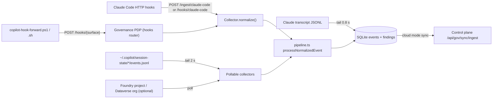
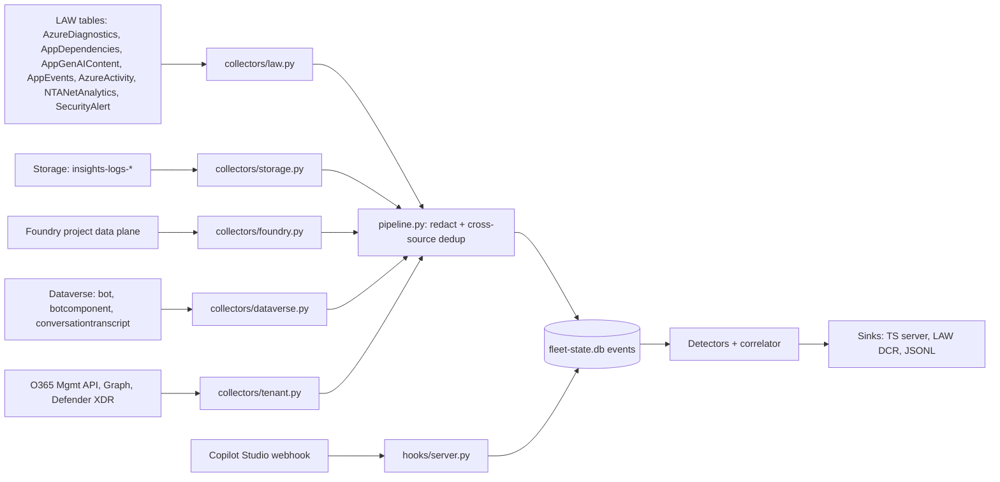

# Data sources

This page lists every data source the platform ingests, on both halves of the product:

- **Endpoint / local monitor** (TypeScript server, `src/`). It receives hook pushes from coding agents, tails local session logs, and can optionally poll one Foundry project and one Dataverse org. It stores `NormalizedEvent` rows in the local SQLite database.
- **Cloud monitoring fleet** (Python, `fleet/src/agentmon_fleet/`). It polls Azure Monitor, Foundry, Dataverse and tenant APIs, and receives the Copilot Studio threat-detection webhook. It stores `CanonicalEvent` rows in `fleet-state.db`, runs its detectors, and pushes alerts to the TypeScript server.

Each source has the same block: what it contains, content depth, collector, permissions, latency, enablement, `CanonicalEvent` / `NormalizedEvent` mapping, and the detections it feeds. The block is a summary. Exact KQL, API calls and setup steps are in the detail docs linked from each section:

- [fleet-sources.md](fleet-sources.md): full fleet source reference (KQL, API calls, RBAC)
- [log-ingestion.md](log-ingestion.md): endpoint pipeline and `NormalizedEvent` mapping tables
- [governance-surfaces.md](governance-surfaces.md): native hook contracts per surface
- [cloud-configuration.md](cloud-configuration.md): step-by-step Azure, Power Platform and tenant setup

## Contents

1. [Master source matrix](#master-source-matrix)
2. [Data flow](#data-flow)
3. [A. Endpoint / local agents](#a-endpoint--local-agents)
4. [B. Microsoft Foundry](#b-microsoft-foundry)
5. [C. Copilot Studio](#c-copilot-studio)
6. [D. Azure platform and tenant](#d-azure-platform-and-tenant)
7. [E. Direct model inference](#e-direct-model-inference)
8. [Normalized event model](#normalized-event-model)
9. [Detection groups](#detection-groups)
10. [Coverage gaps and mitigations](#coverage-gaps-and-mitigations)
11. [Related docs](#related-docs)

---

## Master source matrix

**Content** column: **Full** = prompts, replies, tool arguments and results. **Partial** = some text, truncated or limited to specific events. **Metadata** = identity, counts, status; no conversation text.

| # | Source | Platform | Content | Latency | Collector | `source` / collector id |
|---|---|---|---|---|---|---|
| A1 | Claude Code hooks | Endpoint | Full | Synchronous | `src/collectors/claude-code.ts` | `claude-code` |
| A2 | Claude Code transcript JSONL | Endpoint | Full (thinking, assistant text) | ~0.8 s tail | `src/transcript-watcher.ts` | `claude-code` (capture `log`) |
| A3 | Copilot CLI session log | Endpoint | Full (clipped) | 2 s poll | `src/collectors/copilot-cli.ts` | `copilot-cli` |
| A4 | Copilot CLI / VS Code / cloud agent hooks | Endpoint | Full (result clipped) | Synchronous | `src/governance/hooks/*` + `copilot-cli-hooks.ts` | `copilot-cli-hooks` |
| A5 | Local Foundry poller (classic threads) | Foundry | Metadata + tool payload | 60 s poll | `src/collectors/foundry.ts` | `foundry` |
| A6 | Local Dataverse transcript poller | Copilot Studio | Full (messages only) | 5 min poll + ~30 min platform delay | `src/collectors/copilot-studio.ts` | `copilot-studio` |
| A7 | Device → control-plane sync | Endpoint | Per data policy | 15 s default interval | `src/governance/sync/*` | `/api/gov/sync/ingest` |
| B1 | Foundry resource logs (`AzureDiagnostics`) | Foundry / direct inference | Metadata | Minutes, up to ~2 h | `collectors/law.py` | `law.inference`, `law.audit` |
| B2 | App Insights GenAI traces (`AppDependencies` + `AppGenAIContent`) | Foundry | Full when content recording is on | Minutes | `collectors/law.py` | `law.genai` |
| B3 | Foundry project data plane | Foundry / direct inference | Full | Poll interval (120 s) | `collectors/foundry.py` | `foundry.responses`, `foundry.classic` |
| B4 | Diagnostics archive (`insights-logs-*`) | Foundry / direct inference | Metadata | Hourly blobs | `collectors/storage.py` | `law.inference` |
| C1 | Dataverse `bot` / `botcomponent` | Copilot Studio | Definitions | Poll interval | `collectors/dataverse.py` | profiles only |
| C2 | Dataverse `conversationtranscript` | Copilot Studio | Full incl. plan steps | ~30 min after inactivity | `collectors/dataverse.py` | `dataverse.transcripts` |
| C3 | Agent-level App Insights (`AppEvents`) | Copilot Studio | Partial | Minutes | `collectors/law.py` | `law.cs_events` |
| C4 | Environment-level OTel spans | Copilot Studio | Full (truncated) | Up to 24 h, preview | `collectors/law.py` | `law.genai` |
| C5 | Threat-detection webhook | Copilot Studio | Full for the pending tool call | Synchronous | `hooks/copilot_studio.py` | `hook.copilot_studio` |
| C6 | Purview audit (`CopilotInteraction`, `Bot*`) | Copilot Studio / M365 Copilot | Metadata | Minutes to hours | `collectors/tenant.py` | `tenant.purview` |
| D1 | `AzureActivity` | Azure control plane | Metadata | Minutes | `collectors/law.py` | `law.activity` |
| D2 | VNet flow logs (`NTANetAnalytics`) | Network | Metadata | 10 or 60 min + ingestion | `collectors/law.py` | `law.network` |
| D3 | Defender for Cloud `SecurityAlert` (`AI.*`) | Foundry | Alert text | Minutes after the alert | `collectors/law.py` | `law.defender` |
| D4 | Entra Agent ID inventory + sign-ins | Any | Metadata | Minutes | `collectors/tenant.py` | `tenant.entra` |
| D5 | Defender XDR advanced hunting | Any | Alert text / metadata | Minutes | `collectors/tenant.py` | `tenant.defender`, `tenant.defender.cloudapp` |
| E1 | Direct inference (B1 + B3 + B4, viewed per caller) | Direct inference | Metadata; full only for stored Responses | As B1 / B3 | `law.py`, `foundry.py`, `storage.py` | `law.inference`, `foundry.responses` |
| E2 | APIM LLM log (future) | Direct inference | Full | Minutes (LAW) or seconds (Event Hub) | Not implemented | See [apim-ai-gateway.md](apim-ai-gateway.md) |

Fleet collector paths are relative to `fleet/src/agentmon_fleet/`.

---

## Data flow

### Endpoint / local monitor

### Cloud fleet

The fleet does not write `NormalizedEvent` rows into the TypeScript database. It pushes **alerts and incidents** to `{FLEET_MONITOR_URL}/api/gov/fleet/alerts` and `/api/gov/incidents` (`sinks/base.py`). See [Normalized event model](#normalized-event-model).

---

## A. Endpoint / local agents

Endpoint sources are handled by the TypeScript server. Every event goes through `processNormalizedEvent()` in `src/pipeline.ts`. That function drops duplicates by `externalId`, analyses the unredacted content, and then stores the redacted payload. Mapping tables for each source are in [log-ingestion.md](log-ingestion.md). Native hook contracts are in [governance-surfaces.md](governance-surfaces.md).

### A1. Claude Code hooks

| | |
|---|---|
| **Contains** | `PreToolUse`, `PostToolUse`, `UserPromptSubmit`, `Notification`, subagent and stop lifecycle events. |
| **Content** | Full: `tool_input`, `tool_result`/`error`, prompt, `cwd`, `model`, token `usage`, `transcript_path`. |
| **Collected by** | `src/collectors/claude-code.ts`. Telemetry only: `POST /ingest/claude-code` (`src/routes/ingest.ts`, which acks immediately). Governed: `POST /hooks/claude-code` (`src/governance/hooks/router.ts` + `claude-code.ts` adapter). The PDP decides first, then the payload is normalized with a `policy` outcome. |
| **Permissions** | `/hooks` always requires an authenticated principal with the `Agent` role. In local mode, loopback callers are trusted (`GOVERNANCE_TRUST_LOOPBACK`, default `true`). `/ingest` needs no auth in local mode; in cloud mode it requires the `Agent` role. |
| **Latency** | Synchronous. `/hooks` waits for the PDP up to `HOOK_DEADLINE_MS` (default 110 000). |
| **Enable** | Add HTTP hooks to `~/.claude/settings.json` (see [governance-surfaces.md](governance-surfaces.md#claude-code)). |
| **Mapped fields** | `session_id`→`sessionId`, `agent_id`→`agentId` (default `main`), `tool_use_id`→`toolUseId`, `hook_event_name`→`rawEventName`, usage→`inputTokens`/`outputTokens`/`cacheReadInputTokens`, `captureChannel='hook'`. |
| **Detections** | Local analysis (`src/analytics/analyze.ts`): secret/PII detectors, domain and MCP extraction, risk rules, policy findings. PDP verdicts on `/hooks`. |

### A2. Claude Code transcript watcher

| | |
|---|---|
| **Contains** | Assistant `thinking` and `text` blocks from the session transcript JSONL. `tool_use` blocks are skipped because the hooks already capture them. |
| **Content** | Full reasoning and assistant text, redacted before storage. |
| **Collected by** | `src/transcript-watcher.ts`. Watching starts when a hook event carries `transcript_path` (`src/store.ts`). The watcher reads from the current end of the file every 800 ms. `replayTranscript()` backfills a whole file on demand. |
| **Permissions** | Read access to the local transcript file. |
| **Latency** | About 0.8 s. |
| **Enable** | Automatic once A1 is configured. |
| **Mapped fields** | `eventType` `thinking` / `assistant_text`, `capture_channel='log'`. Written straight to `events` (bypasses `processNormalizedEvent`). |
| **Detections** | Timeline context only. |

### A3. GitHub Copilot CLI session log (pull)

| | |
|---|---|
| **Contains** | `$COPILOT_HOME/session-state/<sessionId>/events.jsonl`: session start/resume/shutdown, model and mode changes, user and assistant messages, `tool.execution_start/complete`, subagents, `permission.requested/completed`, errors. |
| **Content** | Full, with strings clipped (4 000 chars; tool results 3 000). Full text up to 256 KB is kept in `scanText` for detection and is never stored. |
| **Collected by** | `src/collectors/copilot-cli.ts` (pollable). Registered in `src/server.ts` when `session-state` exists. |
| **Permissions** | Read access to the user's Copilot home folder. |
| **Latency** | `COPILOT_CLI_POLL_INTERVAL_MS` (default 2000). The first run imports `COPILOT_CLI_IMPORT_DAYS` (default 7) days. |
| **Enable** | On by default. Set `COPILOT_CLI_ENABLED=false` to disable. `COPILOT_HOME` overrides `~/.copilot`. |
| **Mapped fields** | `captureChannel='log'`. `session.mode_changed` sets `autonomyLevel` (autopilot = 3). Permission events carry a `policy` outcome. |
| **Detections** | As A1, plus autonomy tracking and permission findings (prompted / approved / denied). |

### A4. Copilot CLI, VS Code and Copilot cloud agent hooks (push)

| | |
|---|---|
| **Contains** | Pre/post tool use, prompt submit, stop, subagent and session events. Accepts both the PascalCase/snake_case and the native camelCase payloads. |
| **Content** | Full tool input. Result clipped to 3 000 chars; the full text goes to `scanText`. |
| **Collected by** | Forwarders `scripts/copilot-hook-forward.ps1` / `.sh` (`-Surface copilot-cli\|vscode\|copilot-cloud-agent`) and the cloud template `templates/copilot-cloud-agent/.github/hooks/agent-governance.sh` POST to `/hooks/{surface}`. `src/governance/hooks/copilot.ts` / `vscode.ts` build the `ActionRequest`; `copilot-cli-hooks.ts` normalizes the telemetry. |
| **Permissions** | Same as A1. The cloud agent needs `AGENT_GOVERNANCE_URL` (and optionally `AGENT_GOVERNANCE_TOKEN`) in the repository secret environment, and the control-plane host must be allow-listed in the agent firewall. |
| **Latency** | Synchronous. Fail mode is set by `AGENT_GOVERNANCE_FAIL_MODE` (`open` by default). |
| **Enable** | VS Code: copy `templates/vscode/agent-governance-hooks.json`. Cloud agent: copy `templates/copilot-cloud-agent/.github/hooks/`. See [governance-surfaces.md](governance-surfaces.md#how-to-enable-enforcement-per-surface). |
| **Mapped fields** | `session_id`/`sessionId`, `tool_name`/`toolName`, `tool_input`/`toolArgs`, `timestamp` (epoch ms or ISO), `cwd`. `agentId='main'`, `captureChannel='hook'`, `policy` from the PDP decision. |
| **Detections** | PDP verdicts (allow / deny / ask) and local analysis findings. |

### A5. Local Foundry poller (optional)

| | |
|---|---|
| **Contains** | Classic Agent Service threads → terminal runs → run steps (tool calls, message creation). |
| **Content** | Run metadata, tokens, tool-call payload (`function.arguments`, `output`). Message text is not fetched; only the `message_creation` step details. |
| **Collected by** | `src/collectors/foundry.ts`: `GET {FOUNDRY_ENDPOINT}/threads…` with `api-version=v1`, via `DefaultAzureCredential` and scope `https://ai.azure.com/.default`. |
| **Permissions** | Azure AI User (Foundry User) on the project. The credential comes from `AZURE_TENANT_ID` / `AZURE_CLIENT_ID` / `AZURE_CLIENT_SECRET` or a developer login. |
| **Latency** | `FOUNDRY_POLL_INTERVAL_MS` (default 60 000). |
| **Enable** | Set `FOUNDRY_ENDPOINT=https://<resource>.services.ai.azure.com/api/projects/<project>`. |
| **Mapped fields** | `sessionId`=thread id, `externalId` `foundry:run:<id>` / `foundry:step:<id>:<tc>`, `toolUseId`, `durationMs`, `model`, tokens. |
| **Detections** | Local analysis. For multi-project coverage and v2 agents, use the fleet ([B3](#b3-foundry-project-data-plane)). |

### A6. Local Dataverse transcript poller (optional)

| | |
|---|---|
| **Contains** | `conversationtranscripts`, grouped by `name` + `conversationstarttime` and merged by `BatchId`. |
| **Content** | User and bot message activities, `IntentRecognition` (topic triggered), and `SessionInfo` end/outcome. It does **not** parse `DynamicPlan*` tool steps and does not drop test-pane conversations; the fleet ([C2](#c2-dataverse-conversation-transcripts)) does both. |
| **Collected by** | `src/collectors/copilot-studio.ts`: `GET {DATAVERSE_ORG_URL}/api/data/v9.2/conversationtranscripts`, scope `{org}/.default`. |
| **Permissions** | Dataverse application user with read on `conversationtranscript`. |
| **Latency** | `COPILOT_POLL_INTERVAL_MS` (default 300 000), plus the platform's ~30 min transcript delay. The first run looks back 25 h. |
| **Enable** | Set `DATAVERSE_ORG_URL=https://<org>.crm.dynamics.com`. `COPILOT_BOT_ID` limits it to one bot. |
| **Mapped fields** | `sessionId`=`conversationtranscriptid`, `externalId` `cs:<session>:msg:<activity>`, `eventType` `prompt`/`assistant_text`/`lifecycle`. |
| **Detections** | Local analysis. |

### A7. Endpoint → control-plane sync

In cloud mode, a device batches local decisions, redacted events (`MirroredEvent`) and posture reports to `POST /api/gov/sync/ingest` (`src/governance/sync/ingest-router.ts`). The control plane accepts a device principal or the `Agent` role. It rewrites decision ids as `<deviceId>:<id>` and writes events to the Cosmos DB telemetry sink. The interval is `GOVERNANCE_SYNC_INTERVAL_MS` (default 15 000, minimum 5 000). This is a relay of A1–A6, not a new source.

---

## B. Microsoft Foundry

### B1. Foundry resource logs (`AzureDiagnostics`)

| | |
|---|---|
| **Contains** | Diagnostic-setting categories on Foundry / Azure OpenAI accounts and projects. The fleet queries `RequestResponse`, `AzureOpenAIRequestUsage` and `Audit`. `Trace` and `ManagedNetworkEvent` can be enabled (`allLogs`) but the fleet does not query them. |
| **Content** | **Metadata only. No prompt or completion text.** Operation, result code, duration, caller `objectId`/`callerObjectId`, caller IP, deployment, model, prompt/completion/cached tokens, stream type, request/response bytes. |
| **Collected by** | `collectors/law.py`, query `INFERENCE` in `law_queries.py` (`ResourceProvider == "MICROSOFT.COGNITIVESERVICES"`, fields parsed from `properties_s`). |
| **Permissions** | Log Analytics Reader on the workspace. |
| **Latency** | Minutes; can take up to ~2 h. |
| **Enable** | Diagnostic setting `allLogs` → workspace on each account and project. `FLEET_LAW_WORKSPACE_ID=<workspace-guid>`. See [cloud-configuration.md](cloud-configuration.md). |
| **Mapped fields** | `RequestResponse` / `AzureOpenAIRequestUsage` → `kind=inference`, `platform=azure_openai`, `source=law.inference`, `caller_object_id`, `caller_ip`, `model`, `tokens_in/out`, `status`. `400` + filter operation → `decision=blocked`, `decision_reason=content_filter`. `401`/`403` → `blocked`, `access denied`. `Audit` (e.g. `ListKey`) → `kind=control_plane`, `platform=azure_control_plane`, `source=law.audit`. |
| **Detections** | `INFERENCE_ANOMALY`, `UNREGISTERED_INFERENCE_CALLER`, `ACCESS_DENIED_BURST`, `CONTENT_FILTER_TRIGGERED` (Inference & Network Sentinel). `Audit` → `SENSITIVE_CONTROL_PLANE_OP`, key-enumeration `CREDENTIAL_ACCESS` (Control-plane Auditor). |

### B2. Application Insights GenAI traces

| | |
|---|---|
| **Contains** | OTel GenAI spans in `AppDependencies` (`gen_ai.operation.name` = `invoke_agent`, `execute_tool`, `chat`) joined on `SpanId` to `AppGenAIContent` (`InputMessages`, `OutputMessages`, `SystemInstructions`, `ToolDefinitions`, `ToolCallArguments`, `ToolCallResult`). |
| **Content** | Full, **only if content recording is on** in the tracing configuration. Newer rows keep content only in `AppGenAIContent`; older rows keep it in span `Properties` (`gen_ai.tool.call.arguments`, etc.). The query reads both. |
| **Collected by** | `collectors/law.py`, query `GENAI_SPANS`. |
| **Permissions** | Log Analytics Reader. Add Privileged Monitoring Data Reader if `AppGenAIContent` is a Protected table. |
| **Latency** | Minutes (App Insights ingestion). |
| **Enable** | Connect Application Insights to the Foundry project (server-side tracing for prompt and hosted agents), with the workspace-based component in the fleet workspace. |
| **Mapped fields** | `source=law.genai`, `agent_id`=`gen_ai.agent.id`, `agent_name`, `agent_version`, `session_id`=`gen_ai.conversation.id` (else trace id), `trace_id`, `span_id`, `model`, `tenant_id`=`microsoft.tenant.id`. `execute_tool` → `tool_call` with `tool_name`/`tool_type`/`tool_call_id`/`arguments`/`result`. `invoke_agent` / `chat` → `user_message`, `assistant_message`; `chat` also → pending `tool_call`s and `inference` with `gen_ai.usage.*` tokens. |
| **Detections** | All [content detectors](#detection-groups). Foundry spans are **dropped** for sessions that B3 already covers (`Fleet._drop_cross_source_duplicates`). |

### B3. Foundry project data plane

| | |
|---|---|
| **Contains** | Discovery: ARM `Microsoft.CognitiveServices/accounts` → `projects` (api-version `2025-06-01`) in `FLEET_SCOPE_SUBSCRIPTIONS` / `FLEET_SUBSCRIPTION_ID`. Definitions: `GET {project}/agents` (v2) and `/assistants` (classic), `api-version=v1`. Traffic: `GET {project}/openai/v1/responses` (newest first, at most 200 per cycle) plus `/responses/{id}/input_items`. Classic: `/threads` → `/runs` → `/runs/{id}/steps` + `/messages`. |
| **Content** | Full: user/assistant messages, reasoning summaries, `function_call` / `function_call_output`, `mcp_call`, `mcp_approval_request` / `_response`, `code_interpreter_call` (code + logs), other built-in `*_call` items, content-filter errors. There is no `/conversations` list call; the session is grouped by the response's `conversation` id or the `previous_response_id` chain. |
| **Collected by** | `collectors/foundry.py`, `foundry_items.py`, `foundry_classic.py`, `discovery.py`. Token scope `https://ai.azure.com/.default` (ARM: `https://management.azure.com/.default`). |
| **Permissions** | Azure AI User (Foundry User) on each account/project. Monitoring Reader (or Reader) on subscriptions for discovery. A 401/403 marks the project as denied for the process lifetime. |
| **Latency** | `FLEET_POLL_INTERVAL_S` (default 120). |
| **Enable** | `FLEET_SUBSCRIPTION_ID` or `FLEET_SCOPE_SUBSCRIPTIONS`, and/or `FLEET_FOUNDRY_PROJECT_ENDPOINT` / `FLEET_FOUNDRY_PROJECTS`. `FLEET_CONTENT_PROJECTS` limits deep content collection to matching endpoints; other projects rely on B1/B2. |
| **Mapped fields** | `source=foundry.responses` / `foundry.classic`. A named agent reference → `platform=foundry`, `agent_id`=agent name. No agent → `platform=azure_openai`, `agent_id`=`<project>/<metadata app name or tool set>`. `session_id`=conversation id / chain root, `turn_id`=response id, `user_id`=`user` or `metadata.user_id`. Tokens are set on the last event of the turn. Content-filter / jailbreak errors → `policy_decision` `blocked`. Account and project managed identities are registered as known callers. Profiles come from definitions, plus inline profiles (`derived_by=inline`) for direct Responses apps. |
| **Detections** | All [content detectors](#detection-groups), charters (profiler), `AGENT_CONFIG_CHANGE` on definition-hash drift. |

### B4. Diagnostics storage archive

| | |
|---|---|
| **Contains** | Diagnostic-setting archives in containers `insights-logs-requestresponse` and `insights-logs-azureopenairequestusage` (JSON lines). Azure writes blobs under `resourceId=/SUBSCRIPTIONS//RESOURCEGROUPS/<rg>/PROVIDERS/MICROSOFT.COGNITIVESERVICES/ACCOUNTS/<account>/y=<yyyy>/m=<MM>/d=<dd>/h=<HH>/m=00/PT1H.json`. The collector does not parse the path: it lists every blob and resumes each from a stored byte offset. |
| **Content** | Metadata, as B1. The `Audit` category is not read from storage. |
| **Collected by** | `collectors/storage.py`. It reuses the B1 mapper, so events carry `source=law.inference`. |
| **Permissions** | Storage Blob Data Reader on the account. |
| **Latency** | Hourly `PT1H.json` blobs. |
| **Enable** | `FLEET_STORAGE_ACCOUNT=<account-name>`. It runs only when `FLEET_LAW_WORKSPACE_ID` is unset, or when explicitly selected with `--source storage`. |
| **Mapped fields / detections** | As B1 (inference only). |

---

## C. Copilot Studio

Lab setup for all Copilot Studio sources: [infra/lab/COPILOT-STUDIO-SETUP.md](../infra/lab/COPILOT-STUDIO-SETUP.md).

### C1. Dataverse agent definitions

| | |
|---|---|
| **Contains** | `bots` (`botid`, `name`, `schemaname`, `configuration`, `authenticationmode`) and active `botcomponents` (topics, actions, knowledge sources, `custom_gpt` instructions). |
| **Content** | Agent definitions: instructions (up to 8 000 chars), tools/topics, knowledge names. |
| **Collected by** | `collectors/dataverse.py`, Web API `v9.2`, token scope `{FLEET_DATAVERSE_ORG_URL}/.default`. |
| **Permissions** | Dataverse application user with a read-only role on `bot`, `botcomponent` and `conversationtranscript`. Dataverse auditing **cannot** be enabled on `bot`/`botcomponent` (platform-managed tables), so authoring history comes from C6 and definition-hash drift. |
| **Latency** | Every cycle. |
| **Enable** | `FLEET_DATAVERSE_ORG_URL=https://<org>.crm.dynamics.com`, `FLEET_PP_ENVIRONMENT_ID=<environment-id>`. |
| **Mapped fields** | `AgentProfile` with `agent_key=copilot_studio:<botid>`, `resource_id=<org>\|<env>`. |
| **Detections** | Charter derivation; `AGENT_CONFIG_CHANGE` on drift. |

### C2. Dataverse conversation transcripts

| | |
|---|---|
| **Contains** | Bot Framework activities per conversation, merged across `BatchId` parts: messages, `DynamicPlanReceived`, `DynamicPlanStepTriggered` / `StepBindUpdate` / `StepFinished`, error traces. |
| **Content** | Full: user and bot text, plan steps, tool (task dialog) arguments, observations, the planner's `thought`, errors. |
| **Collected by** | `collectors/dataverse.py` + `dataverse_transcripts.py`. `$filter=createdon gt <cursor>` with an overlap of at least 90 min. |
| **Permissions** | As C1. |
| **Latency** | About 30 min after the conversation goes inactive. |
| **Enable** | As C1. Transcripts exist only for **published** agents and **not** for test-pane conversations (the collector also drops `isDesignMode` conversations). Dataverse deletes transcripts after 30 days by default, so the fleet must poll within that window. |
| **Mapped fields** | `source=dataverse.transcripts`, `session_id`=conversation id (prefix of `name`), `agent_id`=bot id, `user_id`=`from.aadObjectId`, `tenant_id`=`AADTenantId`. `DynamicPlanReceived` → `plan`. Each triggered step → `tool_call` with `tool_call_id=<plan>:<step>`, `arguments`, `result`, `thought`, and `decision` from the step state or block patterns. |
| **Detections** | All [content detectors](#detection-groups). |

### C3. Agent-level Application Insights (`AppEvents`)

| | |
|---|---|
| **Contains** | Custom events: `BotMessageReceived`, `BotMessageSend`, `TopicStart`, `TopicAction`, `TopicEnd`, `GenerativeAnswers`, `OnErrorLog`. |
| **Content** | Partial. `text` is populated only when the agent logs activities / sensitive properties. There are no OTel spans. |
| **Collected by** | `collectors/law.py`, query `CS_EVENTS`. `designMode=true` rows are dropped. |
| **Permissions** | Log Analytics Reader. |
| **Latency** | Minutes. |
| **Enable** | Per agent: **Settings → Advanced → Application Insights** (connection string; turn on activity logging). |
| **Mapped fields** | `source=law.cs_events`, `session_id=conversationId`. `BotMessageReceived` → `user_message`. `BotMessageSend`/`GenerativeAnswers` → `assistant_message`. `TopicAction` with `Kind` in Flow / Connector / HTTP / Skill / AI Builder → `tool_call`. `OnErrorLog` → `error`. |
| **Detections** | Content detectors (limited by the text captured). |

### C4. Environment-level OpenTelemetry export

| | |
|---|---|
| **Contains** | `InvokeAgent`, `ExecuteTool` and `OutputMessages` spans in `AppDependencies` (A365 observability SDK). |
| **Content** | Tool arguments and results, output messages; payloads are truncated. No topic events. |
| **Collected by** | `collectors/law.py`, query `GENAI_SPANS`. Spans are tagged `copilot_studio` by name or by `telemetry.sdk.name` containing `A365ObservabilitySDK`. |
| **Permissions** | Log Analytics Reader. |
| **Latency** | Up to 24 h. **Preview.** Requires a **Managed Environment**. |
| **Enable** | PPAC → Manage → Data export → App Insights → export type **Copilot Studio**. |
| **Mapped fields** | As B2, with `platform=copilot_studio`. These spans are **not** removed by the Foundry span dedup. |
| **Detections** | Content detectors. |

### C5. Real-time threat-detection webhook

| | |
|---|---|
| **Contains** | Copilot Studio's external threat-detection calls (api-version `2025-05-01`): `POST /copilot-studio/validate` and `POST /copilot-studio/analyze-tool-execution`. Each call carries `conversationMetadata` (agent, user, plan/step ids), `plannerContext` (`userMessage`, `chatHistory`, `thought`, previous tool outputs), `toolDefinition` and `inputValues`. |
| **Content** | Full for the pending tool call and its context. Previous outputs follow the `ToolExecutionOutput` schema (`toolId`, `toolName`, `outputs[] {name, value}`, `timestamp`). Both `previousToolOutputs` and `previousToolsOutputs` spellings are accepted. |
| **Collected by** | `hooks/server.py` + `hooks/copilot_studio.py`, run with `agentmon-fleet hooks`. The response is `{blockAction, reasonCode, reason, diagnostics}`. |
| **Permissions** | An Entra app with a federated identity credential for Copilot Studio. The fleet validates the token against `FLEET_HOOKS_AUDIENCE` and `FLEET_HOOKS_ALLOWED_APP_IDS`. `FLEET_HOOKS_TOKEN` is a shared bearer for local/dev only. |
| **Latency** | Synchronous. The fleet's deadline is `FLEET_HOOKS_DEADLINE_MS` (default 850). Any error returns `blockAction: false`. |
| **Enable** | PPAC → Security → Threat detection → Additional threat detection. Mode is `FLEET_HOOKS_MODE` (`observe` by default; charters can opt in to enforce) with threshold `FLEET_HOOKS_BLOCK_THRESHOLD`. Details: [fleet-realtime-hooks.md](fleet-realtime-hooks.md). |
| **Mapped fields** | `source=hook.copilot_studio`. The pending `tool_call` (`tool_call_id=<planId>:<planStepId>`, `arguments=inputValues`, `thought`), context `user_message`s, and `tool_result`s from previous outputs. `resource_id`=environment id. |
| **Detections** | Real-time verdict from the same detectors, with the budget capped for real-time use. Only for **generative orchestration** and only for tool calls. |

### C6. Purview audit (O365 Management Activity API)

| | |
|---|---|
| **Contains** | `Audit.General` content: `CopilotInteraction` (RecordType 261) and Copilot Studio `Bot*` / agent authoring operations. |
| **Content** | Metadata. `CopilotInteraction` carries accessed resources (with sensitivity labels), plugins, message **ids** and `JailbreakDetected` flags, but **no message text**. |
| **Collected by** | `collectors/tenant.py` `PurviewCollector`: `…/activity/feed/subscriptions/content?contentType=Audit.General` in 24 h pages (last 7 days only), then each `contentUri`. Scope `https://manage.office.com/.default`. |
| **Permissions** | Application permission Office 365 Management APIs → `ActivityFeed.Read` (admin consent). |
| **Latency** | Minutes to hours. Overlap is at least 60 min. |
| **Enable** | `FLEET_TENANT_PURVIEW=true` (requires `FLEET_AZURE_TENANT_ID`). `FLEET_PURVIEW_START_SUBSCRIPTION=true` lets the fleet start the subscription once. |
| **Mapped fields** | `source=tenant.purview`. `CopilotInteraction` → `inference` with `effects` (`read_data` per accessed resource, `data_class=label:<id>`) and `policy_decision` `blocked` per jailbreak message. `Bot*` → `control_plane`, `tool_name=POWERPLATFORM/COPILOTSTUDIO/<op>/<READ\|WRITE\|DELETE>`. |
| **Detections** | `AGENT_CONFIG_CHANGE` (Control-plane Auditor), evasion signals from jailbreak denials, effects for charter checks. |

---

## D. Azure platform and tenant

### D1. Azure control plane (`AzureActivity`)

| | |
|---|---|
| **Contains** | Administrative operations on Cognitive Services, ML, Authorization, Key Vault, Insights, Power Platform, Bot Service, Operational Insights and API Management. |
| **Content** | Metadata: operation, status, caller, caller IP, claims (`objectidentifier`). |
| **Collected by** | `collectors/law.py`, query `ACTIVITY`. |
| **Permissions** | Log Analytics Reader. |
| **Latency** | Minutes. |
| **Enable** | Subscription diagnostic setting, `Administrative` category → workspace. |
| **Mapped fields** | `kind=control_plane`, `platform=azure_control_plane`, `source=law.activity`, `tool_name`=`OperationNameValue`, `user_id`=`Caller`, `caller_object_id`, `status`. A failed status → `decision=blocked`. |
| **Detections** | `TELEMETRY_TAMPERING` (diagnostic settings, workspace, App Insights deletes), `SENSITIVE_CONTROL_PLANE_OP` (RAI policies/blocklists, list/regenerate keys, role assignments, Key Vault, connections), `AGENT_CONFIG_CHANGE` (deployments, projects, accounts, Bot Service / Power Platform writes), key-enumeration `CREDENTIAL_ACCESS`. Authorization, Key Vault and diagnostic-settings rules fire only on AI-scoped resources. |

### D2. VNet flow logs / Traffic Analytics (`NTANetAnalytics`)

| | |
|---|---|
| **Contains** | `SubType == "FlowLog"` rows with `FlowType` `ExternalPublic`, `MaliciousFlow`, `AzurePublic`, `UnknownPrivate` or `Unknown`, summarized per source, destination, port, protocol and direction. |
| **Content** | Metadata: IPs (public IPs read from `SrcPublicIps`/`DestPublicIps` when needed), port, L7 protocol, bytes, flow count, allow/deny, country, subnet. |
| **Collected by** | `collectors/law.py`, query `NETWORK`. |
| **Permissions** | Log Analytics Reader. |
| **Latency** | Traffic Analytics interval (10 or 60 min) plus ingestion. |
| **Enable** | VNet flow logs with Traffic Analytics on agent and tool subnets. New NSG flow logs can't be created. |
| **Mapped fields** | `kind=network_flow`, `platform=network`, `source=law.network`, `src_ip`, `dest_ip`, `dest_port`, `bytes_out`. `decision=blocked` only when every status is a denial. `attributes.direction`, `flow_type`, `subnet`, `country`. |
| **Detections** | **Direction matters.** *Inbound* flows are scanner noise against exposed tool endpoints: denied and non-malicious inbound flows are ignored, and an *allowed* inbound `MaliciousFlow` raises one `SUSPICIOUS_NETWORK_FLOW` (exposure) per host per day. *Outbound* (agent egress): `MaliciousFlow` → `SUSPICIOUS_NETWORK_FLOW` (78); `ExternalPublic` over 50 MB → `DATA_EXFILTRATION`; `ExternalPublic` on an uncommon port → `SUSPICIOUS_NETWORK_FLOW`. Destinations in `FLEET_NETWORK_ALLOWED_DESTINATIONS` are skipped. |

### D3. Defender for Cloud AI alerts (`SecurityAlert`)

| | |
|---|---|
| **Contains** | Alerts with `AlertType startswith "AI."` (the `AI.Azure_*` family from AI threat protection). |
| **Content** | Alert name, description, entities, extended properties. |
| **Collected by** | `collectors/law.py`, query `DEFENDER`. |
| **Permissions** | Log Analytics Reader. Security Reader on subscriptions for the Defender side. |
| **Latency** | Minutes after the alert is raised. Requires Sentinel or continuous export to the workspace. |
| **Enable** | Defender for Cloud AI threat protection plus continuous export (or Sentinel). |
| **Mapped fields** | `kind=policy_decision`, `source=law.defender`, `platform=foundry` (fixed), `tool_name`=`AlertType`. Types containing `Blocked` → `decision=blocked`. |
| **Detections** | Passthrough mapped by `DEFENDER_MAP` in `detectors/inference.py`, for example Jailbreak → `JAILBREAK_ATTEMPT`, CredentialTheft → `CREDENTIAL_ACCESS`, ASCIISmuggling → `PROMPT_INJECTION_SUSPECTED`, anonymized/suspicious IP → `UNREGISTERED_INFERENCE_CALLER`. Unmapped types → `SESSION_RISK_ESCALATION`. |

### D4. Entra Agent ID (Microsoft Graph)

| | |
|---|---|
| **Contains** | Inventory: `GET /v1.0/servicePrincipals/microsoft.graph.agentIdentity` (hourly). Sign-ins: `GET /beta/auditLogs/signIns` filtered to service-principal sign-ins with `agent/agentType eq 'AgentIdentity'`. |
| **Content** | Metadata: identity, target resource, IP, error code, risk, Conditional Access status, country. |
| **Collected by** | `collectors/tenant.py` `EntraAgentIdCollector`, scope `https://graph.microsoft.com/.default`. |
| **Permissions** | `Application.Read.All` (or `AgentIdentity.Read.All`) and `AuditLog.Read.All`, application permissions with admin consent. |
| **Latency** | Minutes. |
| **Enable** | `FLEET_TENANT_ENTRA=true`. |
| **Mapped fields** | Identities are registered as known callers (`kind=agent_identity`) and matched to agent keys by name. Successful sign-in → `control_plane` (`ENTRA/AGENTSIGNIN/READ`). Failed sign-in → `policy_decision` `blocked`. `source=tenant.entra`, `caller_object_id`=service principal, `dest_host`=resource. |
| **Detections** | Suppresses false `UNREGISTERED_INFERENCE_CALLER` for registered agent identities. Denials feed the evasion monitor. |

### D5. Defender XDR advanced hunting

| | |
|---|---|
| **Contains** | `AlertInfo` + `AlertEvidence` (AI/agent/Copilot alerts), `BehaviorInfo`, `CloudAppEvents` (Copilot Studio / Power Platform configuration changes) and the `AgentsInfo` inventory. |
| **Content** | Alert and behavior text, entities, ATT&CK techniques. `CloudAppEvents` keeps configuration changes only. |
| **Collected by** | `collectors/tenant.py` `DefenderXdrCollector`: `POST /v1.0/security/runHuntingQuery`. A table that is missing (unlicensed or not onboarded) is skipped for the process lifetime. |
| **Permissions** | `ThreatHunting.Read.All` (application, admin consent). `AgentsInfo` needs Agent 365 licensing. |
| **Latency** | Minutes. |
| **Enable** | `FLEET_TENANT_DEFENDER=true`. |
| **Mapped fields** | Alerts and behaviors → `policy_decision`, `source=tenant.defender`, `platform=foundry` (fixed). `CloudAppEvents` → `control_plane`, `source=tenant.defender.cloudapp`, `platform=copilot_studio`. `AgentsInfo` rows → known-caller identities. |
| **Detections** | Defender passthrough (as D3); `AGENT_CONFIG_CHANGE` for Copilot Studio changes. |

---

## E. Direct model inference

"Direct inference" means people, pipelines or apps calling Foundry / Azure OpenAI model deployments without a registered agent. It isn't a separate collector. It is a view over B1, B3 and B4 under `platform=azure_openai`.

| | |
|---|---|
| **Contains** | Every `RequestResponse` / `AzureOpenAIRequestUsage` row (B1/B4), and stored Responses on project endpoints that have no `agent` reference (B3). |
| **Content** | Diagnostics: metadata only (caller `objectId`, IP, deployment, tokens, status). Responses API: full content, but only when the caller stores responses on a project inside `FLEET_CONTENT_PROJECTS`. |
| **Identity** | Entra-authenticated calls carry `objectId`/`callerObjectId`. **Key-based calls carry no identity**; the only signal is the `ListKey` audit (B1 `Audit`, D1). |
| **Known callers** | The fleet's own identity, `FLEET_KNOWN_CALLERS`, discovered account/project managed identities, Entra agent identities (D4) and `AgentsInfo` (D5) are registered in `identities`. Any other `objectId` is unregistered. |
| **Mapped fields** | `kind=inference`, `caller_object_id`, `caller_ip`, `model`, `tokens_in/out`, `attributes.category/operation/api/cached_tokens/request_bytes/response_bytes`. Direct Responses apps get `agent_id=<project>/<app label>` and an inline profile. |
| **Detections** | `UNREGISTERED_INFERENCE_CALLER` (score 30, once per caller and resource); `INFERENCE_ANOMALY` (hourly tokens over `FLEET_INFERENCE_HOURLY_TOKEN_ALERT`, default 250 000, or mean + 4σ after 6 hours of baseline); `ACCESS_DENIED_BURST` (`FLEET_DENIED_BURST_THRESHOLD`, default 20 in 10 min); `CONTENT_FILTER_TRIGGERED`. The sentinel accepts only `inference` events whose `source` starts with `law.inference` or `storage`. The inventory is available via `agentmon-fleet stats`. |
| **Future** | The APIM AI gateway would add prompt/completion content and per-caller identity for every direct call, via `ApiManagementGatewayLlmLog` + `ApiManagementGatewayLogs`. That design is not implemented; see [apim-ai-gateway.md](apim-ai-gateway.md). |

---

## Normalized event model

The two halves use different schemas, designed for different jobs.

| | `NormalizedEvent` (TS) | `CanonicalEvent` (Python) |
|---|---|---|
| Defined in | `src/collectors/types.ts` | `fleet/src/agentmon_fleet/models.py` |
| Produced by | `Collector.normalize()` / `PollableCollector.poll()` | Fleet collectors, `hooks/*` |
| Store | SQLite `events` + `findings` (`AGENT_MONITOR_DB`); cloud mode mirrors to Cosmos DB via sync | `fleet-state.db` `events` (`FLEET_STATE_DB`), body stored as JSON |
| Event types | `eventType`: `tool_call`, `tool_result`, `prompt`, `lifecycle`, `notification`, `terminal_chunk`, `thinking`, `assistant_text` | `kind`: `session_start`, `session_end`, `user_message`, `assistant_message`, `plan`, `tool_call`, `tool_result`, `inference`, `network_flow`, `control_plane`, `policy_decision`, `error` |
| Source tag | `collectorId` + `captureChannel` (`hook` / `log` / `poll`) | `platform` (`foundry`, `copilot_studio`, `azure_openai`, `network`, `azure_control_plane`, `custom`) + `source` (e.g. `law.genai`) |
| Identity | `sessionId`, `agentId`, `parentAgentId`, `agentType` | `tenant_id`, `resource_id`, `agent_id/name/version`, `session_id`, `turn_id`, `user_id`, `caller_object_id`, `caller_ip` |
| Tool | `toolName`, `toolUseId`, `status`, `durationMs`, `errorText` | `tool_name`, `tool_type`, `tool_call_id`, `arguments`, `result`, `status`, `error` |
| Content | `payload` (redacted before storage), `scanText` (never stored) | `text`, `thought`, `arguments`, `result` (secrets/PII redacted when `FLEET_REDACT_PII=true`) |
| Policy | `policy {outcome, label}`, `autonomyLevel` | `decision` (`allowed`, `blocked`, `failed`, `pending`), `decision_reason` |
| Model | `model`, `inputTokens`, `outputTokens`, `cacheReadInputTokens` | `model`, `tokens_in`, `tokens_out` |
| Network | — | `src_ip`, `dest_ip`, `dest_port`, `dest_host`, `bytes_out` |
| Tracing | `externalId` (dedup), `parentEventId`, `transcriptPath` | `id` (stable hash, dedup), `trace_id`, `span_id` |
| Semantics | — | `effects[]` (`capability`, `resource`, `destination`, `data_class`, `executor`, `evidence`), `attributes{}` |

How they relate:

- **No event-level bridge.** Fleet events are not converted into `NormalizedEvent` rows, and endpoint events are not fed into fleet detectors. The link is at the **alert** level: the fleet posts alerts and incidents to `/api/gov/fleet/alerts` and `/api/gov/incidents` on the TS server (`FLEET_MONITOR_URL`, default `http://127.0.0.1:4317`). The TS dashboard shows them next to local findings.
- **Rough equivalence** for anyone writing a bridge or a query across both stores: `prompt` ≈ `user_message`, `assistant_text` ≈ `assistant_message`, `thinking` ≈ `thought`, `tool_call` with `status=pending` ≈ `tool_call` with `decision=pending`, `tool_result` ≈ `tool_result`, `policy.outcome` `blocked`/`denied` ≈ `decision=blocked`.
- **Overlapping sources.** Foundry and Copilot Studio can be collected by both halves (A5/A6 vs B3/C2). The two produce different session ids for the same Copilot Studio conversation (TS uses `conversationtranscriptid`; the fleet uses the `name` prefix). Enable one or the other for a given project/org, not both, unless you want two independent views.
- **Dedup.** TS drops events whose `externalId` already exists. The fleet uses deterministic `stable_id()` ids, a per-query cursor with an overlap window (`FLEET_OVERLAP_MINUTES`, default 45), and cross-source span dedup (B2 vs B3).

---

## Detection groups

Detectors are in `fleet/src/agentmon_fleet/detectors/`. "Content detectors" in the tables above means every detector that reads conversation and tool events:

| Detector | Consumes | Alert types |
|---|---|---|
| Intent Analyst (`intent.py`) | `user_message`, `tool_result`, `tool_call`, `assistant_message` | `GOAL_DRIFT`, `INTENT_OUT_OF_SCOPE`, `JAILBREAK_ATTEMPT`, `PROMPT_INJECTION_SUSPECTED` |
| Action Analyst (`action.py`) | `tool_call`, `assistant_message` (via `effects`) | `OUT_OF_CHARTER_ACTION`, `FORBIDDEN_CAPABILITY`, `UNAPPROVED_DESTINATION`, `CREDENTIAL_ACCESS`, `DATA_EXFILTRATION`, `DESTRUCTIVE_ACTION`, `OBFUSCATED_CODE`, `OUT_OF_BOUNDS_SCRIPT` |
| Evasion Monitor (`evasion.py`) | `decision=blocked` events, later actions and refusals | `BLOCKED_ACTION_WORKAROUND`, `REPEATED_BLOCKED_ATTEMPTS`, `SOCIAL_ENGINEERING_USER`, `USER_PERSISTENCE_AFTER_BLOCK` |
| Runaway loop (`loop.py`) | `tool_call` | `RUNAWAY_LOOP` |
| User payload (`payload.py`) | `user_message`, `tool_call` | `OBFUSCATED_CODE` |
| Inference & Network Sentinel (`inference.py`) | `inference` (B1/B4), `network_flow`, Defender `policy_decision` | See [E](#e-direct-model-inference), [D2](#d2-vnet-flow-logs--traffic-analytics-ntanetanalytics), [D3](#d3-defender-for-cloud-ai-alerts-securityalert) |
| Control-plane Auditor (`controlplane.py`) | `control_plane`, profile drift | `SENSITIVE_CONTROL_PLANE_OP`, `TELEMETRY_TAMPERING`, `AGENT_CONFIG_CHANGE`, `CREDENTIAL_ACCESS` |
| Correlator (`correlator.py`) | Alerts per session | `SESSION_RISK_ESCALATION`, incidents |

Scoring, charters and framework mappings are covered in [fleet.md](fleet.md).

---

## Coverage gaps and mitigations

| Gap | Effect | Mitigation |
|---|---|---|
| Foundry diagnostic logs (B1/B4) carry no prompt or completion content | You see who, how much and the status, but not what was asked | B3 for allow-listed projects, B2 with content recording, APIM gateway (E2, future) |
| Key-based inference has no caller identity | Direct calls can't be attributed | `ListKey` audit + key-enumeration detection; disable local (key) auth on accounts |
| Code Interpreter and function calling run on the Microsoft backbone; Bing / web search / SharePoint tools use public endpoints | These tool calls never appear in VNet flow logs (D2) | Tool content from B3 (`code_interpreter_call` code + logs) and B2; code analysis in the Action Analyst |
| Traffic outside VNet-injected subnets (Copilot Studio connectors, Microsoft-hosted model calls, unlisted MCP servers) | No network evidence | `ExecuteTool` spans (C4), webhook (C5), Power Platform DLP endpoint filtering |
| D2 inbound flows are mostly Internet scanners | Alert noise if treated as egress | Only allowed inbound `MaliciousFlow` alerts, aggregated per host per day |
| Copilot Studio environment-level OTel (C4) is preview, needs a Managed Environment, lags up to 24 h and truncates payloads | Late or partial spans | C2 transcripts, C3 `AppEvents`, C5 webhook |
| C3 is configured per agent by the maker | Agents without it are dark in `AppEvents` | Enforce with DLP on the Application Insights connector; rely on C2 |
| Transcripts (C2) arrive ~30 min after inactivity, only for published agents and not the test pane, and are kept 30 days by default | Delayed detection; no test-pane coverage | C5 for tool calls in real time |
| The webhook (C5) runs only for generative orchestration and only for tool calls | Classic topics and final answers aren't gated | C2 and C3 |
| `bot` / `botcomponent` can't have Dataverse auditing | No Dataverse authoring history | C6 Purview `Bot*` operations, D5 `CloudAppEvents`, definition-hash drift |
| Purview `CopilotInteraction` (C6) has message ids only | No intent analysis from Purview alone | C2 transcripts |
| `SecurityAlert` (D3) reaches the workspace only via Sentinel or continuous export | No Defender passthrough otherwise | Enable export, or `FLEET_TENANT_DEFENDER=true` (D5) |
| Defender `AgentsInfo` needs Agent 365 licensing | Table skipped | D4 Entra Agent ID inventory |
| Endpoint hooks fail open by default | An unreachable PDP allows actions | `AGENT_GOVERNANCE_FAIL_MODE=closed`; the forwarder script's per-tool fail mode |
| The TS Dataverse poller (A6) does not parse plan steps or drop test-pane conversations | Tool calls missing and test chats included locally | Use the fleet's C2 for Copilot Studio |

The fleet-specific list, with Learn references, is in [fleet-sources.md — Known gaps](fleet-sources.md#known-gaps).

---

## Related docs

- [README.md](README.md): docs index
- [architecture/application.md](architecture/application.md) and [architecture/agents.md](architecture/agents.md): component architecture
- [scan-methodology.md](scan-methodology.md): how events become findings and alerts
- [installation.md](installation.md): installing the monitor and the fleet
- [cloud-configuration.md](cloud-configuration.md): enabling each cloud source
- [fleet-sources.md](fleet-sources.md): fleet KQL, API calls and permissions in full
- [fleet-realtime-hooks.md](fleet-realtime-hooks.md): webhook and `/evaluate` contracts
- [log-ingestion.md](log-ingestion.md): endpoint ingestion pipeline
- [governance-surfaces.md](governance-surfaces.md): hook contracts per surface
- [apim-ai-gateway.md](apim-ai-gateway.md): future direct-inference content source
- [infra/lab/COPILOT-STUDIO-SETUP.md](../infra/lab/COPILOT-STUDIO-SETUP.md): Copilot Studio lab runbook
